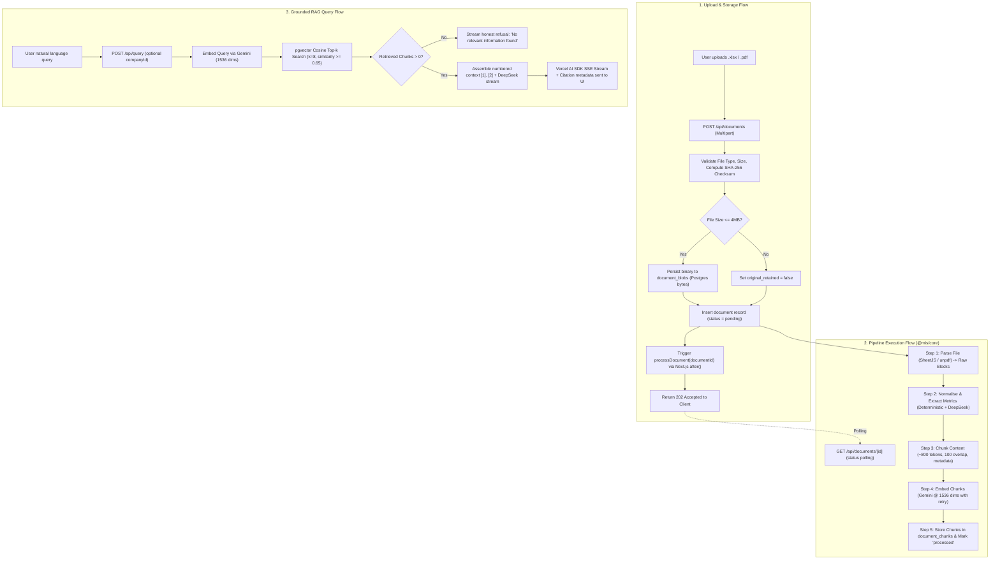
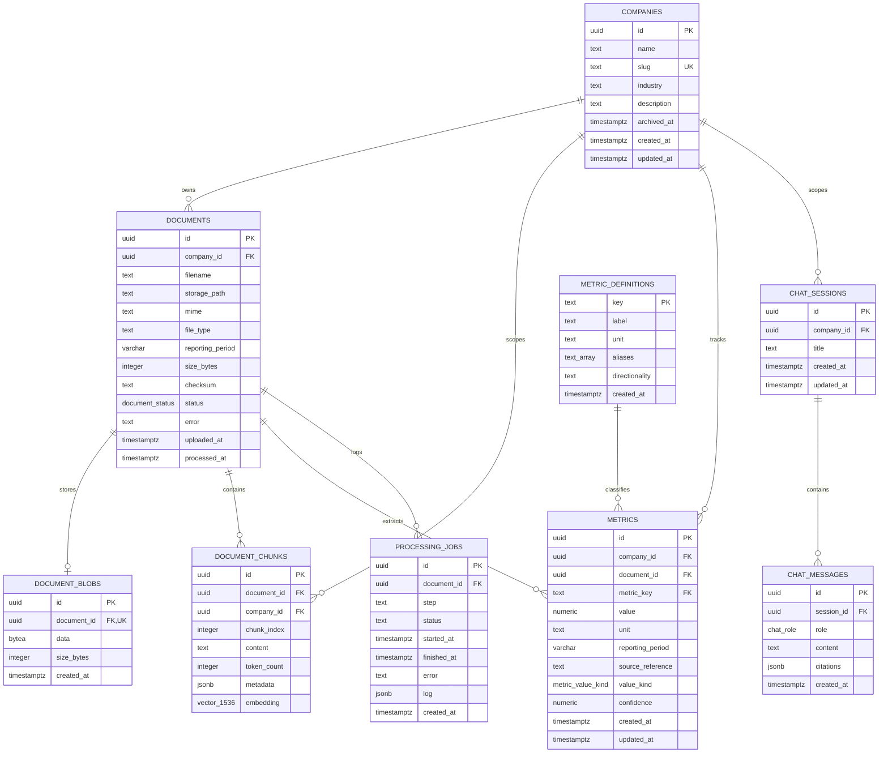
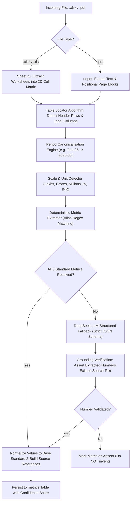
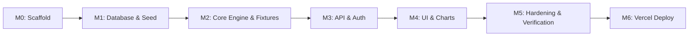

# Portfolio MIS Intelligence Dashboard — Senior Technical Implementation Plan (PLAN_AGY)

Target Directory: `/home/amann/intern-weh/mis-intelligent-dashboard`  
Architecture Baseline: npm-workspaces monorepo (`apps/web`, `packages/db`, `packages/core`), Drizzle ORM, Neon PostgreSQL + pgvector, Vercel AI SDK (chat streaming only), Gemini embeddings, DeepSeek generation/reasoning.  
Status: **Approved Implementation Blueprint (Derived from PRD.md and PLAN.md)**

---

## Executive Summary & Alignment

This document defines the comprehensive, end-to-end technical implementation plan for the **Portfolio MIS Intelligence Dashboard** for WEH Ventures. The platform tracks and analyzes monthly Management Information System (MIS) reports across **~30–40 portfolio companies**, extracting standard financial KPIs (Net Revenue, Gross Margin, EBITDA, Net Burn, Run Rate), generating historical trend visualizations, and providing a grounded, source-cited Natural Language RAG interface.

---

## 1. System Architecture

### 1.1 Monorepo Layout & Package Responsibilities

The project is structured as an npm-workspaces monorepo designed for clean separation of concerns, high testability, and smooth deployment to Vercel and Neon.

```
mis-intelligent-dashboard/
├── package.json                     # Root workspace configuration, scripts, shared dev tooling
├── apps/
│   └── web/                         # Next.js 15 (App Router) — User Interface & HTTP API Layer
│       ├── package.json
│       ├── next.config.ts           # transpilePackages: ["@mis/db", "@mis/core"]
│       ├── tailwind.config.ts       # Tailwind CSS v4 styling & shadcn tokens
│       ├── src/
│       │   ├── app/                 # App Router pages, layouts, and API Route Handlers
│       │   │   ├── layout.tsx       # Root layout (Theme provider, Font, Toaster)
│       │   │   ├── page.tsx         # / — Portfolio overview dashboard
│       │   │   ├── login/           # /login — Team authentication gate
│       │   │   ├── companies/       # /companies — Directory, search, add company
│       │   │   │   └── [slug]/      # /companies/[slug] — Company KPI workspace & charts
│       │   │   │       └── documents/ # /companies/[slug]/documents — Upload dropzone & job logs
│       │   │   ├── settings/        # /settings — Diagnostics, metrics definition reference
│       │   │   └── api/             # REST Route Handlers & SSE streaming endpoints
│       │   ├── components/          # Reusable UI components & shadcn/ui primitives
│       │   ├── hooks/               # Custom React hooks (useCompanyMetrics, useChatStream)
│       │   ├── lib/                 # Web-tier helpers (session, auth cookie, formatters)
│       │   └── middleware.ts        # Edge auth gate checking signed session cookie
├── packages/
│   ├── db/                          # @mis/db — Persistence Layer
│   │   ├── package.json
│   │   ├── drizzle.config.ts        # Drizzle Kit configuration
│   │   ├── drizzle/                 # Versioned SQL migration files (0000_..., 0001_...)
│   │   ├── scripts/                 # Admin scripts (seed-companies-from-crm.ts)
│   │   └── src/
│   │       ├── client.ts            # pg.Pool + Drizzle instance singleton
│   │       ├── migrate.ts           # Standalone migration runner
│   │       ├── index.ts             # Barrel exports
│   │       ├── seed/                # Seed scripts (seed-metric-definitions.ts)
│   │       └── schema/              # Drizzle table definitions, relations, and enums
│   └── core/                        # @mis/core — Domain Business Logic & AI Pipeline
│       ├── package.json
│       ├── fixtures/                # Verified test fixtures (sample_mis.xlsx, sample_mis.pdf)
│       └── src/
│           ├── index.ts             # Barrel exports
│           ├── parsing/             # SheetJS (.xlsx/.xls) & unpdf (.pdf) extractors
│           ├── normalisation/       # Label alias resolver, period parser, unit/scale detector
│           ├── extraction/          # Deterministic table finder + DeepSeek structured fallback
│           ├── chunking/            # Context-aware text chunker with source metadata
│           ├── embeddings/          # Gemini API client with dimension truncation & backoff
│           ├── rag/                 # pgvector similarity search, prompt contract, citation builder
│           └── pipeline/            # End-to-end processDocument orchestrator
├── .env.example                     # Canonical environment variable keys
└── README.md                        # Setup, local verification, and deployment documentation
```

### 1.2 Request and Data Flow Architecture

The data lifecycle encompasses three distinct workflows:



### 1.3 Architectural Refinements & Disagreements with `PLAN.md`

1. **Production File Retention vs Vercel Read-Only Filesystem**:
   * *`PLAN.md` Position*: Initially suggested saving to a path, without specifying how Vercel's ephemeral read-only filesystem retains uploaded files for download/inspection.
   * *Architectural Decision*: Introduce `document_blobs` in Postgres storing `bytea` for files $\le 4\text{ MB}$. Files $> 4\text{ MB}$ have their text and metrics fully indexed, but mark `original_retained = false`. This guarantees zero external cloud dependencies for MVP while maintaining complete download capability for 95% of monthly MIS spreadsheets.
2. **Vercel Serverless Function Timeouts vs Synchronous Pipeline**:
   * *`PLAN.md` Position*: Suggested running processing synchronously within the upload handler for files under a cap.
   * *Architectural Decision*: Running parsing, metric extraction, and batched Gemini embeddings (with rate-limiting) synchronously will exceed Vercel's 15s serverless execution timeout. We decouple the HTTP response from pipeline execution using Next.js `after()` or an immediate `202 Accepted` response, while the client polls `GET /api/documents/[id]` for live status.
3. **Embedding Dimensionality Mismatch**:
   * *`PLAN.md` Position*: Specifies `vector(1536)` in DB and Gemini embeddings.
   * *Architectural Decision*: Gemini `gemini-embedding-001` defaults to 3072 dimensions natively. Calling `embedContent` without `config: { outputDimensionality: 1536 }` will fail on Postgres insertion. The plan explicitly mandates `outputDimensionality: 1536` using Matryoshka Representation Learning (MRL).

---

## 2. Database Design

### 2.1 Complete Relational & Vector Schema (`packages/db`)

All tables are managed via Drizzle ORM with strict typing, explicit foreign key constraints, cascading rules, and optimized indexes.



### 2.2 Table Definitions and Constraints

1. **`companies`**:
   * Columns: `id` (UUID PK default `gen_random_uuid()`), `name` (TEXT NOT NULL), `slug` (TEXT NOT NULL UNIQUE), `industry` (TEXT), `description` (TEXT), `archived_at` (TIMESTAMPTZ), `created_at` (TIMESTAMPTZ NOT NULL DEFAULT `now()`), `updated_at` (TIMESTAMPTZ NOT NULL DEFAULT `now()`).
   * Indexes: `companies_slug_idx` (UNIQUE BTREE on `slug`).
2. **`metric_definitions`**:
   * Columns: `key` (TEXT PK, e.g. `revenue`, `ebitda`), `label` (TEXT NOT NULL), `unit` (TEXT NOT NULL, e.g. `currency`, `percent`), `aliases` (TEXT[] NOT NULL DEFAULT `'{}'::text[]`), `directionality` (TEXT NOT NULL, `up_is_good` | `down_is_good` | `neutral`), `created_at` (TIMESTAMPTZ NOT NULL DEFAULT `now()`).
   * Purpose: Acts as the canonical configuration table. **Adding a new metric requires only an `INSERT` row—zero DDL migrations required.**
3. **`documents`**:
   * Columns: `id` (UUID PK), `company_id` (UUID NOT NULL FK $\to$ `companies.id` ON DELETE CASCADE), `filename` (TEXT NOT NULL), `storage_path` (TEXT NOT NULL), `mime` (TEXT NOT NULL), `file_type` (TEXT NOT NULL, `xlsx` | `xls` | `pdf`), `reporting_period` (VARCHAR(7), format `YYYY-MM`), `size_bytes` (INTEGER NOT NULL), `checksum` (TEXT NOT NULL, SHA-256), `status` (ENUM `document_status`: `pending`, `parsing`, `extracting`, `embedding`, `processed`, `failed`), `error` (TEXT), `uploaded_at` (TIMESTAMPTZ NOT NULL DEFAULT `now()`), `processed_at` (TIMESTAMPTZ).
   * Indexes: `documents_company_checksum_idx` (UNIQUE on `(company_id, checksum)` to reject duplicate uploads), `documents_company_reporting_period_idx` (BTREE on `(company_id, reporting_period)`).
4. **`document_blobs`** (To be added via migration `0001`):
   * Columns: `id` (UUID PK), `document_id` (UUID NOT NULL UNIQUE FK $\to$ `documents.id` ON DELETE CASCADE), `data` (`customType({ dataType: () => 'bytea' })`), `size_bytes` (INTEGER NOT NULL), `created_at` (TIMESTAMPTZ NOT NULL DEFAULT `now()`).
5. **`document_chunks`**:
   * Columns: `id` (UUID PK), `document_id` (UUID NOT NULL FK $\to$ `documents.id` ON DELETE CASCADE), `company_id` (UUID NOT NULL FK $\to$ `companies.id` ON DELETE CASCADE), `chunk_index` (INTEGER NOT NULL), `content` (TEXT NOT NULL), `token_count` (INTEGER), `metadata` (JSONB NOT NULL DEFAULT `'{}'::jsonb`), `embedding` (`vector(1536)`).
   * Indexes:
     * `document_chunks_embedding_hnsw_idx`: HNSW index on `embedding vector_cosine_ops` (`USING hnsw (embedding vector_cosine_ops)`).
     * `document_chunks_metadata_gin_idx`: GIN index on `metadata` (`USING gin (metadata)`).
     * `document_chunks_document_chunk_idx`: BTREE on `(document_id, chunk_index)`.
     * `document_chunks_company_idx`: BTREE on `(company_id)`.
6. **`metrics`**:
   * Columns: `id` (UUID PK), `company_id` (UUID NOT NULL FK $\to$ `companies.id` ON DELETE CASCADE), `document_id` (UUID NOT NULL FK $\to$ `documents.id` ON DELETE CASCADE), `metric_key` (TEXT NOT NULL FK $\to$ `metric_definitions.key` ON DELETE RESTRICT), `value` (NUMERIC NOT NULL), `unit` (TEXT NOT NULL), `reporting_period` (VARCHAR(7) NOT NULL, `YYYY-MM`), `source_reference` (TEXT NOT NULL), `value_kind` (ENUM `metric_value_kind`: `reported`, `calculated`, `estimated`), `confidence` (NUMERIC), `created_at` (TIMESTAMPTZ NOT NULL DEFAULT `now()`), `updated_at` (TIMESTAMPTZ NOT NULL DEFAULT `now()`).
   * Indexes:
     * `metrics_company_key_period_doc_idx`: UNIQUE on `(company_id, metric_key, reporting_period, document_id)`.
     * `metrics_company_key_period_idx`: BTREE on `(company_id, metric_key, reporting_period)` for rapid MoM time-series queries.
7. **`processing_jobs`**:
   * Columns: `id` (UUID PK), `document_id` (UUID NOT NULL FK $\to$ `documents.id` ON DELETE CASCADE), `step` (TEXT NOT NULL), `status` (TEXT NOT NULL DEFAULT `'pending'`), `started_at` (TIMESTAMPTZ), `finished_at` (TIMESTAMPTZ), `error` (TEXT), `log` (JSONB DEFAULT `'{}'::jsonb`), `created_at` (TIMESTAMPTZ NOT NULL DEFAULT `now()`).
   * Indexes: `processing_jobs_document_id_idx` (BTREE on `document_id`).
8. **`chat_sessions` & `chat_messages`**:
   * `chat_sessions`: `id` (UUID PK), `company_id` (UUID NULLABLE FK $\to$ `companies.id` ON DELETE CASCADE, where `null` denotes global query scope), `title` (TEXT DEFAULT `'New Session'`), timestamps.
   * `chat_messages`: `id` (UUID PK), `session_id` (UUID NOT NULL FK $\to$ `chat_sessions.id` ON DELETE CASCADE), `role` (ENUM: `user`, `assistant`, `system`), `content` (TEXT NOT NULL), `citations` (JSONB DEFAULT `'[]'::jsonb`), `created_at` (TIMESTAMPTZ NOT NULL DEFAULT `now()`).

### 2.3 Migration Strategy for Neon & Local PostgreSQL

A fresh database instance must initialize completely from scratch with one command:
```bash
npm run db:migrate && npm run db:seed
```
* **Step 1 (`CREATE EXTENSION`)**: The top of `0000_petite_big_bertha.sql` already begins with:
  ```sql
  CREATE EXTENSION IF NOT EXISTS vector;
  ```
  This ensures compatibility with Neon's managed pgvector extension.
* **Step 2 (Evolution via Migration 0001)**:
  Add `document_blobs` in `packages/db/src/schema/document-blobs.ts` and generate `0001_add_document_blobs.sql` via `drizzle-kit generate`.
* **Step 3 (Seeding)**:
  `npm run db:seed` executes `packages/db/src/seed/seed-metric-definitions.ts` with upsert (`onConflictDoUpdate`) on the 5 standard metrics: `revenue`, `gross_margin`, `ebitda`, `burn`, `run_rate`.

---

## 3. Extraction & Normalisation Strategy

Portfolio MIS reports vary drastically across companies: some report in ₹ Lakhs, some in ₹ Crores, some in USD Millions; some format negatives as `(1,250)`, others as `-1250`; some use multi-level merged headers, others raw tabular dumps.



### 3.1 Step 1: Sheet & Table Localization Algorithm

For spreadsheets (`.xlsx` / `.xls`):
1. **Sheet Filtering**: Inspect sheet names. Skip non-data sheets (`Instructions`, `Readme`, `Summary Chart`, `Glossary`). Prioritize sheets matching `/(mis|p&l|financials?|income statement|operating|performance)/i`. If no match, scan all non-empty sheets.
2. **2D Matrix Scan**: Convert sheet into a 2D matrix of cell values $C[row][col]$.
3. **Header Row Identification**: Scan rows 0 to 25 for a row with $\ge 2$ date/period patterns (e.g. `Jun-25`, `July 2025`, `FY26 Q1`, `2025-06`). Let this row index be $R_{header}$.
4. **Label Column Identification**: Scan columns 0 to 4 for the column containing the highest density of financial keywords (`Revenue`, `Cost of Sales`, `Gross Profit`, `EBITDA`, `Salaries`, `Net Cash Burn`). Let this column index be $C_{label}$.
5. **Bounding Grid**: Data cells reside at $row > R_{header}$ and $col > C_{label}$.

For PDF documents (`.pdf`):
* Parse text blocks per page using `unpdf`.
* Identify table sections by analyzing vertically aligned numeric columns and monospace or tab-delimited text blocks.

### 3.2 Step 2: Period Detection & Canonicalisation

All date/period representations are canonicalized to `YYYY-MM`:
* `Jun-25`, `Jun '25`, `June 2025`, `06/2025` $\to$ `2025-06`
* `Q1 FY26` (Indian Financial Year: April–June 2025) $\to$ `2025-06` (Quarter end)
* `FY25` $\to$ `2025-03`
* Fallback: If a column header simply says `June` without a year, resolve the year from the document's filename or cover metadata (e.g. `Noto_MIS_June_2025.xlsx` $\to$ `2025-06`).

### 3.3 Step 3: Unit, Scale, and Number Parsing

* **Negative Value Handling**: Parenthesized accounting negatives like `(1,234.50)`, `( 45.0 )`, or trailing negatives `1,234-` are parsed into true negative floating-point numbers: `-1234.50`.
* **Currency & Thousand Separators**: Strip currency symbols (`₹`, `Rs.`, `INR`, `$`) and commas before float conversion. Support both Western (`1,000,000`) and Indian (`10,00,000`) digit grouping.
* **Scale Detection & Base Normalization**:
  * Scan sheet title, subtitle, and column headers for scale markers:
    * `In ₹ Lakhs` / `(₹ in L)` $\to$ Multiplier: $10^5$
    * `In ₹ Crores` / `(₹ Cr)` $\to$ Multiplier: $10^7$
    * `In Millions` / `($ M)` $\to$ Multiplier: $10^6$
    * `In Thousands` / `(k)` $\to$ Multiplier: $10^3$
  * **Standardization Rule**:
    * Metrics with `unit = 'currency'` are converted to absolute INR in `metrics.value` (e.g. `1.5 Cr` is stored as `15000000.00`).
    * The original reported representation is preserved verbatim in `source_reference` (e.g. `"Sheet 'P&L', Row 14, Col C (Reported: 1.5 Cr in Lakhs)"`).
    * Metrics with `unit = 'percent'` (e.g. Gross Margin) are stored as percentages on a 0–100 scale (e.g. `42.5` for `42.5%`).

### 3.4 Step 4: Label-to-Metric Alias Mapping Layer

`metric_definitions` powers the normalization lookup table:

| Canonical Key | Label | Unit | Aliases |
|---|---|---|---|
| `revenue` | Revenue | `currency` | `Revenue`, `Net Revenue`, `Sales`, `Total Sales`, `Operating Revenue`, `Total Income`, `Turnover` |
| `gross_margin` | Gross Margin | `percent` | `Gross Margin`, `Gross Margin %`, `GM %`, `GM Percentage`, `Gross Profit Margin %` |
| `ebitda` | EBITDA | `currency` | `EBITDA`, `Operating EBITDA`, `Earnings Before Interest Tax Depreciation` *(Explicitly rejects `EBITDA %`)* |
| `burn` | Net Burn | `currency` | `Burn`, `Monthly Burn`, `Net Burn`, `Net Cash Burn`, `Cash Burn`, `Monthly Cash Burn` |
| `run_rate` | Run Rate | `currency` | `Run Rate`, `Annual Run Rate`, `ARR`, `Annualized Revenue` |

**Matching Precedence**:
1. Exact normalized match (lowercase, trimmed whitespace, stripped special characters).
2. Word-boundary substring match against alias lists.
3. Negative filtering: When searching for absolute `ebitda`, rows matching `/%|margin|ratio/` are strictly excluded.

### 3.5 Step 5: Deterministic-First / LLM-Second Split

1. **Deterministic Pass**:
   * Evaluates the located table matrix against the alias dictionary.
   * If a canonical metric is found with an unambiguous numeric cell in the active period column, extract it with `confidence = 1.00`, `value_kind = 'reported'`, and record the exact cell coordinates (`Sheet1!B14`).
2. **LLM-Assisted Extraction (DeepSeek Fallback)**:
   * Triggered only when one or more canonical metrics cannot be resolved deterministically.
   * Feeds the raw table text (as Markdown) to DeepSeek with a strict JSON schema:
     ```json
     {
       "metrics": [
         {
           "metric_key": "revenue",
           "reported_value": "₹45.2 L",
           "normalized_value": 4520000,
           "unit": "currency",
           "reporting_period": "2025-06",
           "source_reference": "P&L Statement, Row 12 'Net Revenue from Operations'",
           "value_kind": "reported",
           "confidence": 0.88
         }
       ]
     }
     ```
3. **Anti-Hallucination Guardrail**:
   * Every number returned by DeepSeek is searched in the source raw text block.
   * If the number does not appear in the source context, the candidate is discarded.
4. **The "Absent-Never-Invented" Invariant**:
   * If a metric does not exist in the document (e.g. an early-stage company does not report Run Rate or EBITDA), **no row is written to `metrics`**.
   * The UI displays `"N/A"` or `"Not available"`. It is forbidden to output `0` or interpolate missing financial figures.

---

## 4. RAG Design

### 4.1 Chunking Parameters & Structural Context

Financial documents require structural chunking rather than naive character splitting:
* **Target Size**: ~800 tokens (~3,200 characters).
* **Overlap**: ~100 tokens (~400 characters).
* **Justification**: A standard P&L or cash-flow breakdown spans 15–25 rows. A 250-token chunk would sever row line items from column headers, destroying the semantic link between dates and metrics. An 800-token chunk safely retains the table headers alongside all related line items.
* **Table Header Repetition**: For spreadsheet tables exceeding 800 tokens, the detected table column header row is prepended to each subsequent chunk to prevent loss of temporal context.
* **Chunk Metadata Payload (`document_chunks.metadata`)**:
  ```json
  {
    "companyId": "9b1deb4d-3b7d-4bad-9bdd-2b0d7b3dcb6d",
    "companyName": "Noto",
    "documentId": "a1b2c3d4-e5f6-7a8b-9c0d-1e2f3a4b5c6d",
    "filename": "Noto_MIS_June_2025.xlsx",
    "reportingPeriod": "2025-06",
    "sheetName": "P&L Summary",
    "pageNumber": 1,
    "rowStart": 10,
    "rowEnd": 28
  }
  ```

### 4.2 Embedding Model & Output Dimensions

* **Model**: Gemini via `@google/genai` (env var `GEMINI_EMBEDDING_MODEL`, defaulting to `gemini-embedding-001`).
* **Dimension Resolution**:
  * Gemini embeddings natively produce 3072 dimensions (or 768 in legacy models).
  * Postgres database schema enforces `vector(1536)` with HNSW cosine indexing.
  * **Implementation Contract**: All embedding calls must supply `config: { outputDimensionality: 1536 }`:
    ```typescript
    const response = await ai.models.embedContent({
      model: process.env.GEMINI_EMBEDDING_MODEL ?? 'gemini-embedding-001',
      contents: text.trim(),
      config: { outputDimensionality: 1536 }
    });
    ```
* **Rate-Limit & Quota Management**:
  * Free-tier quota operates at 100 RPM.
  * Embeddings are executed with an inter-call throttle (`EMBED_DELAY_MS` defaulting to 1000ms) and exponential backoff retry on HTTP 429 (`RESOURCE_EXHAUSTED`).

### 4.3 Retrieval Strategy

* **Distance Operator**: Cosine distance using pgvector's `<=>` operator (`vector_cosine_ops`).
* **Top-K**: $k = 8$ chunks.
* **Similarity Floor**: Cosine similarity $\ge 0.65$ ($\text{distance} \le 0.35$). Any chunk below this threshold is dropped.
* **Scope Filtering**:
  * Global search: Queries all chunks across the portfolio.
  * Company-scoped search: Enforces `WHERE company_id = :companyId`.

### 4.4 Prompt and Answer Contract

```markdown
You are the WEH Ventures Portfolio Intelligence Assistant. You answer questions strictly using the retrieved portfolio MIS document context below.

CONTEXT:
[1] Document: Noto_MIS_June_2025.xlsx | Period: 2025-06 | Company: Noto | Sheet: P&L Summary
Net Revenue: ₹1,50,00,000. COGS: ₹87,00,000. Gross Profit: ₹63,00,000. EBITDA: -₹18,00,000.

[2] Document: Noto_MIS_May_2025.xlsx | Period: 2025-05 | Company: Noto | Sheet: P&L Summary
Net Revenue: ₹1,35,00,000. EBITDA: -₹22,00,000.

INSTRUCTIONS:
1. ANSWER FIRST: State the direct numerical answer in the first sentence.
2. CITATIONS: Cite sources using [1], [2] immediately following the facts they support.
3. REPORTED VS CALCULATED:
   - If a number is directly stated, report it as stated.
   - If you compute a metric (e.g. EBITDA margin or MoM growth), explicitly label it [CALCULATED] and show the exact arithmetic: e.g. "Gross Margin was 42.0% [CALCULATED: (₹63L / ₹150L) * 100] [1]".
4. REFUSAL POLICY: If the retrieved context does not contain the answer, state clearly: "I cannot find this information in the uploaded MIS reports for [Company / Period]." Never invent or extrapolate numbers.
```

### 4.5 Citation Serialization to UI

Citations are streamed to the frontend alongside the response stream:
```typescript
export interface Citation {
  index: number;
  documentId: string;
  filename: string;
  companyName: string;
  reportingPeriod: string;
  sheetOrPage: string;
  snippet: string;
}
```
The client renders interactive pills `[1]` that highlight the corresponding excerpt in an expandable citation drawer.

---

## 5. API Surface

All endpoints validate payloads via **Zod** and return standard JSON error envelopes:
```json
{
  "error": {
    "code": "BAD_REQUEST",
    "message": "Detailed explanation",
    "details": []
  }
}
```

| Method | Path | Auth | Request Validation (Zod) | Response Shape | Error Codes |
|---|---|---|---|---|---|
| `GET` | `/api/health` | Public | None | `{ ok: boolean, db: "up" \| "down" }` | `503 Service Unavailable` |
| `POST` | `/api/auth/login` | Public | `z.object({ username: z.string(), password: z.string() })` | `{ ok: true, user: { username: string } }` | `401 Unauthorized` |
| `POST` | `/api/auth/logout` | Session | None | `{ ok: true }` | `401 Unauthorized` |
| `GET` | `/api/auth/session` | Session | None | `{ authenticated: boolean, user: { username: string } }` | `401 Unauthorized` |
| `GET` | `/api/companies` | Session | `z.object({ search: z.string().optional(), industry: z.string().optional(), sort: z.enum(['name', 'revenue', 'period', 'updated']).optional(), page: z.coerce.number().default(1) })` | `{ companies: CompanySummary[], total: number }` | `400 Bad Request` |
| `POST` | `/api/companies` | Session | `z.object({ name: z.string().min(1), industry: z.string().optional(), description: z.string().optional() })` | `Company` | `409 Slug Conflict` |
| `GET` | `/api/companies/[id]` | Session | None (UUID or slug param) | `Company & { latestMetrics: Record<string, Metric> }` | `404 Not Found` |
| `PATCH` | `/api/companies/[id]` | Session | `z.object({ name: z.string().optional(), industry: z.string().optional(), description: z.string().optional() })` | `Company` | `400 Bad Request` |
| `DELETE` | `/api/companies/[id]` | Session | `z.object({ hard: z.enum(['true', 'false']).optional() })` | `{ ok: true, archived: boolean }` | `404 Not Found` |
| `GET` | `/api/companies/[id]/metrics` | Session | `z.object({ from: z.string().regex(/^\d{4}-\d{2}$/).optional(), to: z.string().regex(/^\d{4}-\d{2}$/).optional(), keys: z.string().optional() })` | `{ series: Record<MetricKey, MetricPoint[]> }` | `400 Bad Request` |
| `POST` | `/api/documents` | Session | Multipart: `file: File` ($\le 15\text{ MB}$, `.xlsx`/`.xls`/`.pdf`), `companyId: z.string().uuid()` | `{ document: Document, message: string }` | `400 Invalid File`, `409 Duplicate File` |
| `GET` | `/api/documents` | Session | `z.object({ companyId: z.string().uuid().optional(), status: z.string().optional() })` | `{ documents: Document[] }` | `400 Bad Request` |
| `GET` | `/api/documents/[id]` | Session | None (UUID param) | `{ document: Document, jobs: ProcessingJob[], metrics: Metric[], blobRetained: boolean }` | `404 Not Found` |
| `GET` | `/api/documents/[id]/file` | Session | None (UUID param) | Binary Stream (`Content-Disposition: inline`) | `404 File Not Retained` |
| `DELETE` | `/api/documents/[id]` | Session | None (UUID param) | `{ ok: true }` | `404 Not Found` |
| `POST` | `/api/query` | Session | `z.object({ question: z.string().min(1), companyId: z.string().uuid().optional(), sessionId: z.string().uuid().optional() })` | SSE Stream (`text-event-stream` with AI SDK chunks + citations) | `400 Bad Request`, `500 AI Failure` |

---

## 6. File Storage Decision Under Vercel Limits

### 6.1 Evaluation of Storage Options

| Option | Pros | Cons | Verdict |
|---|---|---|---|
| **Option A: Postgres Bytea (`document_blobs`)** | Zero additional services; transactional cascading deletes; works immediately with existing `DATABASE_URL`. | Increases Postgres database storage; memory intensive for huge files. | **Recommended for MVP ($\le 4\text{ MB}$ cap)** |
| **Option B: External S3 / Vercel Blob** | High scalability; unlimited file sizes. | Requires external AWS/Vercel Blob tokens and accounts not currently configured. | **Post-MVP Upgrade Path** |
| **Option C: Ephemeral (No Retention)** | Zero storage overhead. | Cannot download or inspect original MIS files after upload. | Rejected |

### 6.2 The Hybrid Storage Architecture

1. Files $\le 4\text{ MB}$ (covering ~95% of monthly MIS spreadsheets):
   * Raw bytes stored in the `document_blobs` table (`bytea`).
   * `/api/documents/[id]/file` streams the stored binary directly to the user with proper MIME headers.
2. Files $> 4\text{ MB}$:
   * Full text, parsed tables, chunks, embeddings, and metrics are extracted and indexed into Postgres.
   * The original binary is discarded to protect Postgres memory; `documents.storage_path` records `none`, and UI surfaces `"Original file > 4MB not retained"`.
3. In local development:
   * Files are mirrored to the gitignored `./uploads/` directory for developer convenience.

---

## 7. Auth & Security Posture

### 7.1 MVP Authentication Strategy

* **Shared Team Credentials**: Configured via server-side environment variables `AUTH_USERNAME` and `AUTH_PASSWORD`.
* **Timing-Safe Comparison**: Utilizes `crypto.timingSafeEqual` on SHA-256 hashes of credentials to eliminate timing-attack vulnerabilities.
* **Session Cryptography**:
  * Issues a cryptographically signed cookie `mis_session` containing `{ username, issuedAt, expiresAt }`.
  * Signed with HMAC-SHA256 using `COOKIE_SECRET`.
  * Cookie Flags: `HttpOnly; SameSite=Lax; Path=/; Max-Age=604800` (7 days); `Secure` enabled in production (`process.env.NODE_ENV === 'production'`).
* **Middleware Gate (`middleware.ts`)**:
  * Protects all web pages and `/api/*` routes.
  * Whitelists only `/login`, `/api/auth/login`, `/api/health`, and `/_next/*` static assets.

### 7.2 Security Invariants & Client Leak Proofing

* **Zero API Key Leakage**: `GEMINI_API_KEY`, `DEEPSEEK_API_KEY`, `DATABASE_URL`, and `COOKIE_SECRET` are strictly server-side. The production client build (`.next/static/**`) must be verified to contain zero references to these secrets.
* **Upload Validation**:
  * MIME type inspection: `application/vnd.openxmlformats-officedocument.spreadsheetml.sheet`, `application/vnd.ms-excel`, `application/pdf`.
  * Extension whitelist: `.xlsx`, `.xls`, `.pdf`.
  * Magic byte verification on buffer headers to prevent disguised executable uploads.
* **Input Sanitization**: All user search strings and inputs sanitized against SQL injection (via Drizzle parameterized queries) and XSS (via React auto-escaping).

### 7.3 Production-Grade Roadmap (Post-MVP)

* Replace shared password with Google Workspace OAuth (restricting domain to `@wehventures.com`).
* Introduce Redis/Upstash rate limiting on `/api/auth/login` and `/api/query`.
* Add an immutable `audit_logs` table recording all uploads, metric edits, and deletions.

---

## 8. UI Information Architecture & Component Inventory

### 8.1 Design Language & Layout Principles

* **Aesthetic**: Polished, modern portfolio intelligence terminal. Light mode primary with seamless dark mode support (`next-themes`).
* **Typography & Data Presentation**:
  * Clean sans-serif UI type; tabular figures (`font-mono`) for all monetary values.
  * Compact Indian currency notation: `₹1.5 Cr`, `₹45.0 L`, `₹8.2 k`, `-₹12.0 L`.
  * Clear visual cues for deltas (emerald for positive MoM growth, rose for burn/negative trends).
* **States**: Every view implements explicit **Loading (Skeleton)**, **Empty (Guidance state)**, and **Error (Recovery action)** views.

### 8.2 Page Specifications

```
Page Flow:
/login ──────────> / (Portfolio Overview)
                        │
                        ├───────> /companies (Directory)
                        │              │
                        │              └───────> /companies/[slug] (Company Workspace)
                        │                             │
                        │                             └───────> /companies/[slug]/documents (Upload & History)
                        │
                        └───────> /settings (Diagnostics & Metric Definitions)
```

1. **`/login` (Authentication Gate)**:
   * Purpose: Team login.
   * UI: Centered minimalist card, username/password fields, autofocus, clear error messaging.
2. **`/` (Portfolio Overview)**:
   * Purpose: High-level portfolio health and recent activity.
   * Content:
     * KPI Strip: Total Companies Tracked, Documents Uploaded (Current Month), Reporting Rate (%), Total Latest Revenue.
     * Portfolio Trend Chart: Aggregated monthly revenue across portfolio with company breakdown.
     * Recent Uploads Table: Filename, company, status pill, upload time.
     * Global AI Query Panel: Instant RAG search over all companies.
3. **`/companies` (Company Directory)**:
   * Purpose: Manage and filter the ~30–40 portfolio companies.
   * Content: Search bar, industry filter dropdown, sort selector (Revenue, Reporting Period, Name). Desktop table collapsing to card grid on mobile. "Add Company" modal dialog.
4. **`/companies/[slug]` (Company Intelligence Workspace)**:
   * Purpose: Deep-dive into an individual company's financial performance.
   * Content:
     * Header: Name, industry, latest reporting period, "Upload MIS" button.
     * 5 Standard KPI Cards: Net Revenue, Gross Margin (%), EBITDA, Net Burn, Run Rate (each with current value, MoM delta arrow, and reported/calculated badge).
     * MoM Historical Trend Charts: Interactive Recharts line/bar chart with metric toggle tabs (Revenue, EBITDA, GM, Burn) and period selector (6M, 12M, All).
     * Complete Metrics Table: Tabular period breakdown with clickable source document links.
     * Inline Scoped AI Chat: Chat interface scoped to this company's documents.
5. **`/companies/[slug]/documents` (Document Center)**:
   * Purpose: Upload MIS files, view processing status, and inspect job logs.
   * Content: Drag-and-drop file dropzone, upload queue with per-file progress, documents table with status pills (`Pending`, `Parsing`, `Extracting`, `Embedding`, `Processed`, `Failed`), job timeline drawer, download link for retained files.
6. **`/settings` (Diagnostics & Definitions)**:
   * Purpose: System diagnostics and canonical metric alias dictionary.
   * Content: Active AI models, DB connection status, pgvector index health, and full table of metric definitions with their active aliases.

### 8.3 Component Inventory

| Component | File Path | Props | Purpose |
|---|---|---|---|
| `AppShell` | `apps/web/src/components/layout/app-shell.tsx` | `children: ReactNode` | Responsive sidebar, topbar, user profile, theme toggle |
| `KpiCard` | `apps/web/src/components/dashboard/kpi-card.tsx` | `label: string, value: string \| null, delta?: number, period?: string, kind?: 'reported' \| 'calculated', status: 'ready' \| 'loading' \| 'empty'` | Displays financial KPI with MoM delta and source badge |
| `TrendChart` | `apps/web/src/components/dashboard/trend-chart.tsx` | `data: MetricPoint[], metricKey: string, unit: string, directionality: string` | Recharts responsive line/bar chart with custom tooltips |
| `MetricTable` | `apps/web/src/components/dashboard/metric-table.tsx` | `metrics: Metric[], onSelectSource: (ref: string) => void` | Financial matrix table with period columns and source popover |
| `UploadDropzone` | `apps/web/src/components/documents/upload-dropzone.tsx` | `companyId: string, onUploadComplete: () => void` | Drag-and-drop file upload with validation and progress |
| `StatusPill` | `apps/web/src/components/ui/status-pill.tsx` | `status: DocumentStatus \| JobStatus` | Color-coded status badge with animated pulsing on pending |
| `QueryPanel` | `apps/web/src/components/ai/query-panel.tsx` | `companyId?: string, placeholder?: string` | Natural language chat input with streaming output and stop |
| `CitationList` | `apps/web/src/components/ai/citation-list.tsx` | `citations: Citation[], onCitationClick: (c: Citation) => void` | Clickable citation badges linking to source document view |
| `DocumentDetailDrawer`| `apps/web/src/components/documents/document-detail-drawer.tsx` | `documentId: string \| null, onClose: () => void` | Slide-over drawer showing pipeline job logs and raw blocks |
| `DataTable` | `apps/web/src/components/ui/data-table.tsx` | `columns: ColumnDef<T>[], data: T[], searchKey?: string` | Reusable sortable table with mobile card fallback |

---

## 9. Processing Under Vercel Limits

### 9.1 Serverless Function Constraints

* **Vercel Hobby**: 15s execution timeout, 4.5MB request payload limit.
* **Vercel Pro**: 60s execution timeout, 4.5MB request payload limit.
* **AI Model Latencies**:
  * Parsing a 20-sheet Excel workbook: ~1.5s.
  * DeepSeek structured extraction: ~3–6s.
  * Gemini batch embedding with throttling (1s per call): ~5–15s.

### 9.2 The Asynchronous Pipeline Seam

To guarantee execution never fails with a Vercel 504 Gateway Timeout:
1. **Immediate HTTP Response**:
   `POST /api/documents` performs file validation, stores metadata and binary in Postgres, sets status to `pending`, and immediately responds with `202 Accepted`:
   ```json
   {
     "document": { "id": "...", "status": "pending" },
     "message": "Upload accepted. Processing started."
   }
   ```
2. **Background Execution**:
   In Next.js 15 App Router, processing is triggered non-blockingly using `after()` from `next/server`:
   ```typescript
   import { after } from 'next/server';
   import { processDocument } from '@mis/core';

   after(async () => {
     await processDocument(documentId);
   });
   ```
3. **Idempotent Job Pipeline (`packages/core/src/pipeline/index.ts`)**:
   Each stage updates `processing_jobs` independently:
   * `parse` $\to$ `normalise` $\to$ `extract` $\to$ `chunk` $\to$ `embed`.
   * If a step fails, the document is marked `failed` with the exact error stored in `documents.error`.
4. **Zero-Rewrite Worker Upgrade Path**:
   Because `processDocument(documentId)` is a self-contained function accepting only an ID, migrating from Next.js `after()` to a persistent background queue (Inngest, QStash, or BullMQ) requires altering only the dispatch line, leaving core domain logic untouched.

---

## 10. Milestones & Verifiable Gates

Each milestone is strictly ordered and accompanied by the exact CLI command required to verify completion:



### Milestone 0: Monorepo Scaffold & Workspace Setup
* **Deliverables**: Root `package.json` workspaces, `apps/web` (Next.js 15, React 19, Tailwind v4), `packages/db`, `packages/core` stub, `.env.example`, `.gitignore`.
* **Verification Command**:
  ```bash
  npm run typecheck && npm run lint && npm run build --workspace=apps/web
  ```
  *Gate: Exit code 0, clean build, zero TypeScript errors.*

### Milestone 1: Database Layer, Migrations, & Seed (`@mis/db`)
* **Deliverables**: Drizzle schemas, `0000_petite_big_bertha.sql`, `0001_add_document_blobs.sql`, HNSW index, `seed-metric-definitions.ts`, and read-only CRM company import script.
* **Verification Command**:
  ```bash
  npm run db:migrate && npm run db:seed && npm run db:seed:crm
  ```
  *Gate: `psql` proves all 8 tables exist, HNSW index confirmed via `\d+ document_chunks`, and $\ge 30$ companies seeded.*

### Milestone 2: Core Processing & RAG Engine (`@mis/core`)
* **Deliverables**: SheetJS/unpdf parsing, normalization engine, deterministic table extractor, DeepSeek structured extraction, Gemini embeddings with `outputDimensionality: 1536`, RAG retrieval with citation builder.
* **Verification Command**:
  ```bash
  npx tsx packages/core/src/cli/test-pipeline.ts packages/core/fixtures/sample_mis.xlsx
  ```
  *Gate: Extracts 5 standard metrics, generates 1536-dim embeddings in local DB, and answers test queries with citations.*

### Milestone 3: API Layer, Validation, & Authentication
* **Deliverables**: Route handlers under `apps/web/src/app/api/`, Zod schemas, constant-time team password auth, signed cookie middleware, streaming `/api/query`.
* **Verification Command**:
  ```bash
  npx tsx scripts/test-api-e2e.ts
  ```
  *Gate: Verifies 401 on unauthenticated route, login cookie issuance, document upload, status polling, metric retrieval, and streaming RAG response.*

### Milestone 4: Product UI, MoM Visualizations, & User Flows
* **Deliverables**: Responsive pages (`/`, `/companies`, `/companies/[slug]`, `/companies/[slug]/documents`, `/settings`), Recharts MoM trend charts, KPI cards, citation drawers, light/dark themes.
* **Verification Command**:
  ```bash
  npm run build --workspace=apps/web && npx tsx scripts/verify-ui-headless.ts
  ```
  *Gate: Headless browser captures clean screenshots of all routes at 1440px and 380px viewports with zero console errors.*

### Milestone 5: Hardening, Test Suite, & Deployment Readiness
* **Deliverables**: Vitest unit test suite (normalization, chunking, citation formatting), secret leak audit, fresh throwaway database migration test (`mis_fresh_check`), root `vercel.json`.
* **Verification Command**:
  ```bash
  npm run test && git grep -nE "sk-[A-Za-z0-9]{20,}|npg_[A-Za-z0-9]{12,}|AQ\.[A-Za-z0-9_-]{20,}" $(git rev-list --all)
  ```
  *Gate: All tests pass; zero secret patterns found in git history or client bundles.*

### Milestone 6: Production Deployment
* **Deliverables**: Vercel preview deployment, environment configuration verification, production promotion.
* **Verification Command**:
  ```bash
  npx vercel --prod
  ```
  *Gate: Live Vercel production URL responds with `{"ok":true,"db":"up"}` at `/api/health`.*

---

## 11. Risks, Unknowns, and Ambiguities

1. **Spreadsheet Format Inconsistency Across 40 Companies**:
   * *Risk*: Portfolio companies use vastly different spreadsheet templates (horizontal vs vertical months, merged header cells, missing period labels).
   * *Resolution*: Implement a dual-strategy engine: a 2D bounding grid detector for standard tables, backed by DeepSeek structured extraction for irregular layouts. Strict grounding verification ensures no hallucinated numbers enter the database.
2. **Gemini Embedding Dimensionality**:
   * *Risk*: Gemini's native 3072 output dimension conflicts with Drizzle's `vector(1536)` column definition.
   * *Resolution*: Pass `config: { outputDimensionality: 1536 }` to `@google/genai` `embedContent`. This leverages Matryoshka Representation Learning to guarantee 1536-dimensional vectors.
3. **Gemini API Free-Tier Rate Limits (100 RPM)**:
   * *Risk*: Uploading a multi-page PDF or 10-sheet workbook generates 50+ chunks at once, triggering HTTP 429 errors.
   * *Resolution*: Implement sequential batch chunking with a mandatory delay (`EMBED_DELAY_MS` = 1000ms) and exponential backoff retry logic.
4. **Vercel Serverless 4.5MB Payload Ceiling**:
   * *Risk*: Uploading files $> 4.5\text{ MB}$ directly to Next.js route handlers will fail at the Vercel edge.
   * *Resolution*: Document a 4.5MB ceiling for Vercel Serverless deployments in the README. For local development, allow up to 15MB.
5. **Soft vs Hard Deletion of Portfolio Companies**:
   * *Risk*: Deleting a company could orphan historical metrics or corrupt RAG retrieval.
   * *Resolution*: Default to soft delete (`companies.archived_at`), excluding the company from directory views while preserving historical data. Hard delete (`?hard=true`) explicitly cascades across all documents, chunks, and metrics.

---

## 12. Out of Scope for MVP

To ensure high quality and rapid delivery, the following are explicitly out of scope for the MVP:
1. **Multi-tenant RBAC**: No granular permissions or per-user roles. Access control uses a single shared team password.
2. **Third-Party Integrations**: No direct Google Drive, Dropbox, or Gmail automatic ingestion. Documents are uploaded via the web UI.
3. **In-Browser Spreadsheet Editing**: No cell-level editing or spreadsheet recalculation engine.
4. **OCR for Scanned Image-Only PDFs**: Processing supports text-based PDFs and native `.xlsx`/`.xls` files. Scanned image PDFs without text layers are rejected.
5. **Custom Formula Builder**: Standard metrics are limited to the 5 canonical KPIs. User-defined custom SQL formulas are deferred to Phase 2.
6. **Automated Alerts & Digest Emails**: No scheduled email reports or Slack notification webhooks.
