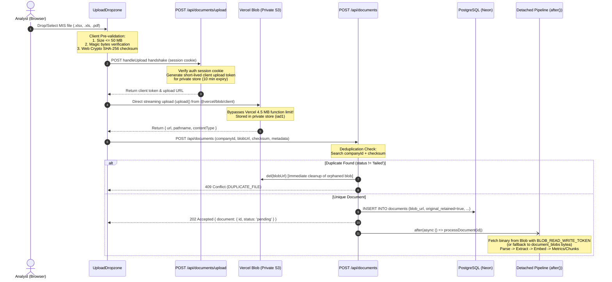
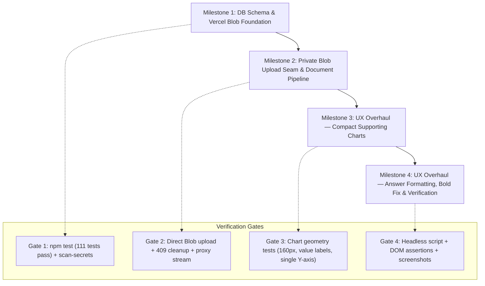

# Technical Implementation Plan: Vercel Blob Migration & UX Overhaul of Charts & Answers

**Document:** `PLAN_BLOB_UX.md`  
**Target Repository:** `/home/amann/intern-weh/mis-intelligent-dashboard`  
**Scope:** Vercel Blob Client-Side Upload Migration (Part A) + Editorial UX Overhaul for Charts & Answers (Part B)  
**Strict Directives:** Plan mode only — change no production code, run no build steps, perform no git commits.

---

## 1. Executive Summary & Design Alignment

This technical implementation plan addresses two critical directives from the dashboard owner:

1. **Part A — Vercel Blob Storage Migration:**  
   *"vercel blob use karo I have vercel pro so"*  
   Replace legacy in-database `bytea` binary retention with **client-side Vercel Blob uploads**, completely bypassing Vercel's 4.5 MB serverless function payload limit. This allows Vercel Pro to accept large, multi-sheet MIS exports up to 50 MB (configurable). Original files are stored securely in a **private** Blob store, proxied through authenticated application endpoints (`/api/documents/[id]/file`), preserving SHA-256 duplicate detection, detached AI processing seams (`after()`), and 100% backward compatibility for existing uploaded files (such as the demo file).

2. **Part B — UX Overhaul for Charts & Answers:**  
   *"the response is good but the chart format and the response formatting is bad yaar thoda usko fix karo ux perspective se"*  
   Address the comprehensive 11-point designer critique by transforming oversized, unlabelled, noisy bar charts into compact, supporting editorial plots (150–170 px) with readable value labels on every bar, single left-only Y-axis geometry, emphasized zero baselines, clean horizontal dashed gridlines, and responsive 2-column grids (≥1280 px). Fix markdown bold rendering root causes, replace loud orange citation badges with quiet editorial footnote marks, establish paragraph rhythm with a top key-figures strip (derived deterministically from chart payloads), distinct trend callout and basis meta treatments, and enforce a 680 px reading measure.

All changes adhere strictly to the **WEH CRM Warm Editorial System** (`CLAUDE-DESIGN-RULES.md`):
- Warm neutrals only (`#FAFAF8` surface, `#FFFFFF` card, `#1A1815` text, `#5A5650` secondary, `#9A958E` muted, `#E8E5DE` borders).
- Terracotta accent (`#FF7102`) reserved for high-signal moments; negative metrics in crimson (`#B42318`).
- Headings in Playfair Display (weight 500 only — never 700).
- UI and narrative in Syne; numbers, labels, units, and code in DM Mono.
- Editorial generous body line-height `1.60` (`leading-[1.60]`).
- Depth achieved via warm ring shadows (`box-shadow: 0 0 0 1px #E8E5DE`) rather than heavy drop shadows.

---

## 2. Part A — Vercel Blob Storage Migration Architecture

### Architecture Diagram: Direct Client-Side Upload & Detached Ingestion Flow



### 1. Package & API Strategy: Why Client-Side Upload is Mandatory

- **Package Choice:** `@vercel/blob` (server management: `del`, `handleUpload`) and `@vercel/blob/client` (browser direct `upload`).
- **The Core Architectural Constraint:**  
  Vercel Serverless Functions enforce a strict, unconfigurable request body payload limit of **4.5 MB** across all subscription tiers (including Vercel Pro). An upload route that receives `multipart/form-data` directly on the server will fail with HTTP `413 FUNCTION_PAYLOAD_TOO_LARGE` at the edge gateway before any route handler code can execute.
- **The Client-Side Upload Solution:**  
  Using `upload()` from `@vercel/blob/client` streams file bytes directly from the user's browser to Vercel's Blob storage service (backed by Amazon S3). The Next.js serverless functions only process lightweight JSON control payloads:
  1. Issuing short-lived upload tokens in `/api/documents/upload`.
  2. Recording document metadata in `/api/documents`.
- **Upload Ceiling:**  
  - **Default Limit:** **50 MB** (`UPLOAD_MAX_BYTES_BLOB`). This comfortably accommodates 5-year operating models with dozens of worksheet tabs, historical actuals, and heavy board decks.
  - **Constant & Overrides:**
    ```ts
    // apps/web/src/lib/constants.ts
    export const UPLOAD_MAX_BYTES_BLOB =
      Number(process.env.BLOB_UPLOAD_MAX_BYTES) || 50 * 1024 * 1024; // 50 MB default
    export const UPLOAD_MAX_BYTES_DEV = 50 * 1024 * 1024;
    ```

### 2. End-to-End Upload, Validation, and Failure Recovery Flow

1. **Client-Side Pre-flight Validation (`UploadDropzone`):**
   - User drops or selects a file (`.xlsx`, `.xls`, `.pdf`).
   - Browser computes SHA-256 digest using Web Crypto API:
     ```ts
     const arrayBuffer = await file.arrayBuffer();
     const hashBuffer = await crypto.subtle.digest('SHA-256', arrayBuffer);
     const checksum = Array.from(new Uint8Array(hashBuffer))
       .map((b) => b.toString(16).padStart(2, '0'))
       .join('');
     ```
   - Magic byte verification confirms file integrity before network transfer:
     - PDF: `%PDF-` (`0x25, 0x50, 0x44, 0x46, 0x2D`)
     - XLSX: `PK\x03\x04` (`0x50, 0x4B, 0x03, 0x04`)
     - XLS: `\xD0\xCF\x11\xE0` (`0xD0, 0xCF, 0x11, 0xE0`)
   - Immediately rejects files exceeding `UPLOAD_MAX_BYTES_BLOB` or failing magic byte checks.

2. **Server Handshake (`/api/documents/upload/route.ts`):**
   - Implements Vercel Blob's `handleUpload`:
     ```ts
     import { handleUpload, type HandleUploadBody } from '@vercel/blob/client';
     import { verifySession } from '@/lib/auth';
     import { SESSION_COOKIE_NAME, UPLOAD_MAX_BYTES_BLOB } from '@/lib/constants';
     import { apiError } from '@/lib/api-response';

     export async function POST(request: NextRequest): Promise<NextResponse> {
       const sessionCookie = request.cookies.get(SESSION_COOKIE_NAME)?.value;
       const session = await verifySession(sessionCookie);
       if (!session) return apiError('UNAUTHORIZED', 'Authentication required', 401);

       const body = (await request.json()) as HandleUploadBody;
       const jsonResponse = await handleUpload({
         body,
         request,
         onBeforeGenerateToken: async (pathname, clientPayload) => {
           let payload: { companyId?: string } = {};
           if (clientPayload) {
             try { payload = JSON.parse(clientPayload); } catch {}
           }
           return {
             allowedContentTypes: [
               'application/vnd.openxmlformats-officedocument.spreadsheetml.sheet',
               'application/vnd.ms-excel',
               'application/pdf',
               'application/octet-stream',
             ],
             maximumSizeInBytes: UPLOAD_MAX_BYTES_BLOB,
             validUntil: Date.now() + 10 * 60 * 1000, // 10 min expiry
             tokenPayload: JSON.stringify({
               companyId: payload.companyId,
               username: session.username,
             }),
           };
         },
         onUploadCompleted: async () => {
           // Registration finalized by client in POST /api/documents
         },
       });
       return NextResponse.json(jsonResponse);
     }
     ```

3. **Direct Browser Streaming Upload:**
   - In `apps/web/src/components/documents/upload-dropzone.tsx`:
     ```ts
     import { upload } from '@vercel/blob/client';

     const blob = await upload(sanitizedFilename, file, {
       access: 'private',
       handleUploadUrl: '/api/documents/upload',
       clientPayload: JSON.stringify({ companyId }),
     });
     ```

4. **Registration via `POST /api/documents`:**
   - Client submits JSON metadata:
     `{ companyId, filename, blobUrl: blob.url, blobPathname: blob.pathname, sizeBytes: file.size, checksum, mime: file.type }`
   - **Deduplication Check:** Server queries `documents` for identical `(company_id, checksum)`:
     - If duplicate exists and `status !== 'failed'`:
       * Server immediately triggers cleanup: `await del(blobUrl, { token: process.env.BLOB_READ_WRITE_TOKEN })` so orphaned blobs do not accumulate.
       * Returns `409 DUPLICATE_FILE`.
   - **Database Insertion:** Inserts record with `blob_url`, `blob_pathname`, `storage_path = blobUrl`, and `original_retained = true`.
   - **Detached Processing:** Initiates ingestion via Next.js `after()`:
     ```ts
     after(async () => {
       try {
         await processDocument(doc.id);
         invalidateCaches();
       } catch (err) {
         console.error(`Detached processing error for doc ${doc.id}:`, err);
       }
     });
     ```

5. **Partial Failure Recovery Matrix:**
   - *Client disconnects during upload:* Vercel Blob aborts incomplete upload; no database record is created.
   - *Duplicate rejected or validation fails:* Server triggers explicit `del(blobUrl)` to clean up unreferenced blob.
   - *Extraction or embedding fails:* `documents.status` transitions to `'failed'` with error diagnostics; original blob is preserved so the administrator can inspect or re-process.

### 3. Schema Changes & Dual-Read Fallback Architecture

#### Drizzle Schema Definition (`packages/db/src/schema/documents.ts`):
```ts
export const documents = pgTable(
  'documents',
  {
    id: uuid('id').defaultRandom().primaryKey(),
    companyId: uuid('company_id')
      .notNull()
      .references(() => companies.id, { onDelete: 'cascade' }),
    filename: text('filename').notNull(),
    storagePath: text('storage_path').notNull(), // Preserved: holds blobUrl or legacy path
    blobUrl: text('blob_url'),                   // [NEW] Vercel Blob S3 URL
    blobPathname: text('blob_pathname'),         // [NEW] Vercel Blob internal pathname
    mime: text('mime').notNull(),
    fileType: text('file_type').notNull(),
    reportingPeriod: varchar('reporting_period', { length: 7 }),
    sizeBytes: integer('size_bytes').notNull(),
    checksum: text('checksum').notNull(),
    status: documentStatusEnum('status').notNull().default('pending'),
    error: text('error'),
    originalRetained: boolean('original_retained').default(true).notNull(),
    uploadedAt: timestamp('uploaded_at', { withTimezone: true }).defaultNow().notNull(),
    processedAt: timestamp('processed_at', { withTimezone: true }),
  },
  (table) => [
    uniqueIndex('documents_company_checksum_idx').on(table.companyId, table.checksum),
    index('documents_company_reporting_period_idx').on(table.companyId, table.reportingPeriod),
  ]
);
```

#### Drizzle Migration (`packages/db/drizzle/0003_add_document_blob_url.sql`):
```sql
ALTER TABLE "documents" ADD COLUMN IF NOT EXISTS "blob_url" text;
ALTER TABLE "documents" ADD COLUMN IF NOT EXISTS "blob_pathname" text;
```

#### 3-Tier Binary Retrieval Fallback:
Existing documents (e.g. the demo file `DEMO_sample_mis.xlsx`) have their binary content stored in PostgreSQL `bytea` format in the `document_blobs` table. The binary retrieval pipeline in `apps/web/src/lib/documents.ts` and `packages/core/src/pipeline/index.ts` implements a guaranteed 3-tier fallback so that **zero historical documents break**:

```ts
export async function getDocumentBinary(
  id: string
): Promise<{ buffer: Buffer; mime: string; filename: string } | null> {
  const [doc] = await db.select().from(documents).where(eq(documents.id, id));
  if (!doc) return null;

  // Tier 1: Primary Path — Vercel Blob Private Store
  if (doc.blobUrl) {
    try {
      const res = await fetch(doc.blobUrl, {
        headers: {
          Authorization: `Bearer ${process.env.BLOB_READ_WRITE_TOKEN}`,
        },
      });
      if (res.ok) {
        const arrayBuf = await res.arrayBuffer();
        return { buffer: Buffer.from(arrayBuf), mime: doc.mime, filename: doc.filename };
      }
    } catch (err) {
      console.warn(`Vercel Blob fetch failed for doc ${id}, attempting fallback:`, err);
    }
  }

  // Tier 2: Legacy Fallback — document_blobs bytea table (supports existing demo file)
  const [blob] = await db.select().from(documentBlobs).where(eq(documentBlobs.documentId, id));
  if (blob?.data) {
    return { buffer: blob.data, mime: doc.mime, filename: doc.filename };
  }

  // Tier 3: Dev Fallback — Local filesystem storage
  if (doc.storagePath && fs.existsSync(path.resolve(process.cwd(), doc.storagePath))) {
    const fileBytes = fs.readFileSync(path.resolve(process.cwd(), doc.storagePath));
    return { buffer: fileBytes, mime: doc.mime, filename: doc.filename };
  }

  return null;
}
```

- **Retirement Strategy for `document_blobs`:**  
  `document_blobs` will **not** be dropped during this migration. It remains active to support existing demo records. Only after all historical records have been backfilled to Vercel Blob (`blob_url IS NOT NULL`) and verified with `SELECT count(*) FROM document_blobs WHERE document_id NOT IN (SELECT id FROM documents WHERE blob_url IS NOT NULL) = 0`, a separate cleanup migration (`0004_drop_document_blobs.sql`) will be scheduled.

### 4. Access Model & Authenticated Streaming (`/api/documents/[id]/file`)

- **Security Principle:** Financial MIS documents contain proprietary, price-sensitive portfolio data. Storage must be configured with `access: 'private'`.
- **Token Protection:** The `BLOB_READ_WRITE_TOKEN` is **never exposed** to the client. The client never receives signed or public URLs that could be intercepted.
- **Authenticated Proxy Route (`apps/web/src/app/api/documents/[id]/file/route.ts`):**
  1. Authenticates incoming user requests via session cookie: `verifySession(sessionCookie)`. Unauthenticated requests immediately receive `401 Unauthorized`.
  2. Verifies document metadata:
     - If `doc.originalRetained === false`: returns 404 with error code `FILE_NOT_RETAINED`.
  3. Retrieves binary data via `getDocumentBinary(id)`.
  4. Streams binary data back to the client using `NextResponse` with strict security headers:
     ```ts
     return new NextResponse(binaryBuffer, {
       status: 200,
       headers: {
         'Content-Type': doc.mime || 'application/octet-stream',
         'Content-Disposition': `inline; filename="${encodeURIComponent(doc.filename)}"`,
         'Content-Length': String(binaryBuffer.length),
         'Cache-Control': 'private, no-transform, max-age=3600',
       },
     });
     ```

### 5. Environment Variables & Secret Scanner Compliance

- **Environment Variable:** `BLOB_READ_WRITE_TOKEN`
- **Configuration Locations:**
  - Vercel Project Dashboard: Connected to private store `mis-uploads` in region `iad1`.
  - Local Private Store: Stored in `~/.hermes/private/mis-secrets.env`.
  - Repository Template (`.env.example`): Name and comment only:
    ```env
    # Vercel Blob Storage (Private Store Read/Write Token)
    BLOB_READ_WRITE_TOKEN=
    ```
- **Secret Scanner Integrity:**  
  `scripts/scan-secrets.ts` enforces zero committed secrets. Raw token strings are never logged, printed, or committed to git.

### 6. Storage Cleanup & UI States for Retained/Deleted Files

- **Document Deletion Cascades (`deleteDocument(id)`):**
  When an analyst deletes a document via `DELETE /api/documents/[id]`:
  1. Retrieve `doc.blobUrl`.
  2. If `doc.blobUrl` exists: call `del(doc.blobUrl, { token: process.env.BLOB_READ_WRITE_TOKEN })`. If the blob was already removed upstream, catch and log the warning without aborting database deletion.
  3. Delete the database record (cascades to chunks, metrics, jobs, and legacy blobs).
- **UI States for Non-Retained or Deleted Files:**
  - If `doc.originalRetained === false`: In the document drawer and list, render an amber status indicator: `"Original file not retained · Metrics & AI citations remain active"`. The download action is rendered in a disabled state with a descriptive tooltip.
  - If storage returns a 404 upstream: Render a clean inline notice: `"File binary unavailable in storage. Extracted metrics and citations are preserved."`

---

## 3. Part B — UX Overhaul: Charts & Answer Formatting

### Design System Tokens & Editorial Rules (`CLAUDE-DESIGN-RULES.md`)

```
Surface:          #FAFAF8 (Warm parchment light)
Card Background:  #FFFFFF (Ivory card surface)
Borders:          #E8E5DE (Warm cream border) / Dark: #2E2A24
Depth Shadow:     Warm ring: box-shadow: 0 0 0 1px #E8E5DE (no heavy drop shadows)
Text Primary:     #1A1815 (Warm near-black)
Text Secondary:   #5A5650 (Olive gray)
Text Muted:       #9A958E (Warm stone)
Accent:           #FF7102 (Terracotta orange — high-signal only)
Accent Tints:     #FFEFE2 (Background tint), #FFD0AB (Subtle border)
Negative Series:  #B42318 (Crimson — negative EBITDA, burn, contraction)
Alt Series:       #3A5F8C (Slate navy — comparison series)
Typography:       Playfair Display (500 only for headings), Syne (UI/body), DM Mono (numbers/labels)
```

---

### Exact Chart Design Specifications (Addressing Critiques 1–7)

```
┌───────────────────────────────────────────────────────────────────────────────────────────┐
│ RE-ENGINEERED COMPACT EDITORIAL METRIC CHART (160 px plot, value labels, headroom, no noise)│
└───────────────────────────────────────────────────────────────────────────────────────────┘

  [ NET REVENUE · NOTO ]                                               Jun'25 → Sep'25
  ────────────────────────────────────────────────────────────────────────────────────
   ₹2.5Cr ┬
          │                                                       ₹2.0Cr
          │                                        ₹1.82Cr       ┌──────┐
   ₹1.5Cr ┼                         ₹1.66Cr       ┌──────┐       │      │
          │          ₹1.5Cr        ┌──────┐       │      │       │      │
          │         ┌──────┐       │      │       │      │       │      │
   ₹0.5Cr ┼         │      │       │      │       │      │       │      │
          │         │      │       │      │       │      │       │      │
        0 ┴─────────┴──────┴───────┴──────┴───────┴──────┴───────┴──────┴────────────
                     Jun'25         Jul'25         Aug'25         Sep'25
```

| Parameter | Current Flaw | Exact Target Value | Architectural & Editorial Rule |
|---|---|---|---|
| **Plot Container Height** | ~430 px tall (dominates answer) | **`160 px` (Desktop)**<br>**`140 px` (Mobile ≤640 px)** | The plot is a compact supporting element, subordinate to the narrative. |
| **Card Padding** | `p-4` (16 px) | **`p-3.5` (14 px) Desktop**<br>**`p-2.5` (10 px) Mobile** | Tight editorial enclosure maximizing data-to-ink ratio. |
| **Value Labels** | Missing (hover required) | **`<LabelList>` on bars**<br>Font: `DM Mono`, `9.5 px`, weight `500`<br>Offset: `4 px`<br>Color: `#5A5650` (Dark: `#A8A39A`) | Reader never needs to hover to learn numbers. Suppressed if >8 bars to prevent crowding. |
| **Y-Axis Configuration** | Duplicated on right side, clipped labels | **Single Left Axis ONLY**<br>`axisLine={false}`, `tickLine={false}`<br>Tick count: **≤ 4 ticks** (`tickCount={4}`)<br>Format: Compact Indian (`₹2.0Cr`, `₹50L`, `0`, `-₹18L`) | Right axis completely eliminated. Zero label clipping. |
| **Chart Margins** | `{ top: 8, right: 8, left: -14, bottom: 0 }` | `{ top: 18, right: 12, left: -6, bottom: 0 }` | 18 px top margin guarantees headroom so value labels never clip into card borders. |
| **Gridline Style** | `3 3` dashed, stray dots/lines | **Horizontal ONLY** (`vertical={false}`)<br>`strokeDasharray="2 4"`<br>Stroke: `#E8E5DE` (Dark: `#2E2A24`), opacity `0.7`<br>**Zero stray dots / leftover series** | Subtle dashed lines guide the eye without visual noise. |
| **Domain & Headroom** | 15% rounding | **18% domain padding**<br>`domainMax = Math.ceil(maxVal * 1.18)`<br>`domainMin = Math.floor(minVal * 1.18)` | Bars never touch the ceiling; value labels have dedicated clearance. |
| **Bar Rounded Corners** | `[2, 2, 2, 2]` | Positive: **`radius={[4, 4, 0, 0]}`**<br>Negative: **`radius={[0, 0, 4, 4]}`** | Rounded only on the growing edge; flat against the zero baseline. |
| **Bar Sizing & Gaps** | Default unconstrained | **`barCategoryGap="24%"`**<br>**`maxBarSize={36}`** | Prevents monolithic thick bars on wide displays; consistent pacing. |
| **Zero Baseline Treatment** | Faint `#E8E5DE` 1px line | Emphasized Reference Line:<br>`<ReferenceLine y={0} stroke="#9A958E" strokeWidth={1.5} />` | Clear ground line for positive growth; clear ceiling for negative EBITDA/burn. |
| **Negative Values** | Ambiguous coloring | Fill: **`#B42318` (Crimson)**<br>Value label includes explicit minus sign: `-₹18L` | Accessible and immediately recognizable without relying solely on color. |
| **Multi-Chart Layout (≥1280 px)** | Vertical stack for 2 charts | **2-Column Grid (`grid-cols-1 xl:grid-cols-2 gap-3.5`) for ≥2 charts** | Revenue and EBITDA sit side-by-side on desktop, halving vertical scroll height. |
| **Mobile Layout (412 px)** | Overflow risk | **Single Column (`space-y-2.5`), 140 px plot, zero overflow** | Tested on 412×915 mobile viewport; 100% responsive. |

---

### Exact Answer Text Formatting Specifications (Addressing Critiques 8–11)

#### 1. Markdown Bold Bug Root Cause & Architectural Fix (Critique 8)

- **Root Cause Investigation:**
  1. **Direct String Rendering in `QueryPanel`:** In `apps/web/src/components/ai/query-panel.tsx` (lines 235–241), the streaming answer was rendered as raw string text:
     `<div className="text-sm leading-relaxed text-foreground whitespace-pre-wrap font-sans">{streamingAnswer}</div>`.
     `ReactMarkdown` was never invoked here, leaving literal asterisks `**₹2.0 Cr**` visible in the UI across the dashboard home and company workspaces!
  2. **Bracket Munging in `ChatMessageRenderer`:** In `apps/web/src/components/chat/chat-message-renderer.tsx` (line 36), the citation preprocessing regex:
     `res = res.replace(/(?<!\[)\[(\d+)\](?!\()/g, '[[#cite-$1]](#cite-$1)');`
     When bold text contained or adjoined citations (e.g. `**₹2 Cr [1]**` or `**₹2 Cr** [1]`), the nested bracket replacement broke CommonMark delimiter pairing for `**...**`, causing markdown parsers to treat asterisks as literal characters.
  3. **CSS Reset Contrast:** In Tailwind v4, `@theme` resets require high-contrast weights for `<strong>` elements to distinguish clearly from normal prose in the Syne typeface.

- **The Architectural Fix:**
  - Unify `QueryPanel` and `ChatThread` to both use `ChatMessageRenderer`.
  - Refactor citation tokenization: Do not inject nested markdown link syntax. Instead, replace `[n]` with clean custom citation tokens `[cite:$1]` or superscript links that do not corrupt CommonMark delimiter stacks.
  - Provide explicit high-contrast styling for `strong`:
    ```tsx
    strong: ({ children }) => (
      <strong className="font-semibold text-[#1A1815] dark:text-[#FAFAF8] tracking-tight">
        {children}
      </strong>
    )
    ```
  - **Regression Test:** Create `tests/chat-message-renderer.test.tsx` asserting that `**key figure** [1]` properly emits `<strong>` elements in the rendered DOM tree.

#### 2. Subordinate Inline Citation Markers (Critique 9)

- **Current Behavior:** Loud orange badges (`bg-[#FFEFE2] text-[#FF7102] border-[#FFD0AB] font-semibold`) scattered mid-sentence that interrupt reading flow.
- **Target Specification:**
  - Quiet, subordinate editorial marks styled like academic footnotes:
    ```tsx
    <button
      type="button"
      onClick={() => onCitationClick(citation)}
      className="inline-flex items-center justify-center font-mono text-[9.5px] px-1 py-0 mx-0.5 rounded text-[#9A958E] dark:text-[#87867F] hover:text-[#FF7102] hover:bg-[#F5F4F0] dark:hover:bg-[#26231F] transition-colors cursor-pointer align-baseline select-none"
      title={`${citation.filename} · chunk #${citation.chunkIndex}`}
    >
      [{num}]
    </button>
    ```
  - Prominent card styling remains exclusively in the grouped **"SOURCES & CITATIONS"** drawer at the bottom of the answer.

#### 3. Answer Layout Rhythm, Key-Figures Strip, Trend & Basis Blocks (Critique 10)

- **Key-Figures Strip (Top of Answer):**
  When structured metrics are present, render 2–4 scannable chips at the top of the answer card before narrative prose:
  - **Source of Truth:** Derived purely from the deterministic chart payload (`X-Charts` / `metrics` rows). Zero extra queries, zero model hallucination.
  - **Typography & Styling:** `DM Mono`, `11 px`, muted `#5A5650` text on `#FAFAF8` background, warm ring border (`border-[#E8E5DE]`).
  - **Visual Discipline:** Accent colour (`#FF7102`) used only for the primary headline metric (e.g. Net Revenue); secondary metrics use muted tones. Omitted if fewer than 2 figures exist.
  ```
  ┌────────────────────────────────────────────────────────────────────────┐
  │ [ ₹2.00 Cr Net Revenue (Sep'25) ]  [ -₹18.0 L EBITDA ]  [ 42.0% GM ]   │
  └────────────────────────────────────────────────────────────────────────┘
  ```

- **Prose Measure & Typography:**
  - **Font Size:** `14.5 px` (`text-[14.5px]`).
  - **Line Height:** `1.60` (`leading-[1.60]`) — editorial standard from `CLAUDE-DESIGN-RULES.md`.
  - **Paragraph Spacing:** `mb-3.5` (14 px) between paragraphs.
  - **Container Width:** Constrained to **`max-w-[680px]`** (68–72 characters per line) to prevent line-tracking fatigue.

- **"So the Trend to Watch" Editorial Callout:**
  When text begins with `**So the trend to watch:** ...`, render as an editorial pull-quote card:
  - Left border: `2 px solid #FF7102` (terracotta accent).
  - Background: `bg-[#FAFAF8] dark:bg-[#1A1815]`.
  - Padding: `px-3.5 py-2.5 my-3 rounded-r-lg`.
  - Typography: `text-[13.5px] italic text-[#1A1815] dark:text-[#FAFAF8] leading-[1.55]`.

- **Basis Row (Muted Provenance Meta):**
  When text matches `Basis: ...`:
  - Position: Pushed to the bottom directly above citation drawer.
  - Styling: `pt-2.5 mt-3 border-t border-[#E8E5DE]/70 text-[11px] font-mono text-[#9A958E] dark:text-[#7A7670] leading-normal`.

---

### Complete Exact Values Matrix

```
┌────────────────────────────────────────────────────────────────────────────────────────┐
│ COMPREHENSIVE EXACT PARAMETER SPECIFICATION TABLE                                      │
├────────────────────────────────┬───────────────────────────┬───────────────────────────┤
│ Element                        │ Exact Value / Tailwind    │ Design System Token       │
├────────────────────────────────┼───────────────────────────┼───────────────────────────┤
│ Chart plot height (Desktop)    │ 160 px                    │ Compact supporting plot   │
│ Chart plot height (Mobile)     │ 140 px                    │ 412 px viewport safe      │
│ Chart card padding             │ 14 px (p-3.5) / 10 px mob │ Base-8 spacing scale      │
│ Chart card border              │ 1 px solid #E8E5DE        │ Warm ring shadow depth    │
│ Chart side-by-side breakpoint  │ >= 1280 px (xl:grid-cols-2)│ 2 columns for >=2 charts  │
│ Bar category gap               │ 24%                       │ Consistent bar pacing     │
│ Bar max width                  │ 36 px                     │ Non-monolithic bars       │
│ Bar corner radius (Positive)   │ [4, 4, 0, 0]              │ 4 px top curve            │
│ Bar corner radius (Negative)   │ [0, 0, 4, 4]              │ 4 px bottom curve         │
│ Value label font               │ DM Mono, 9.5 px, weight 500 Numbers / units only       │
│ Value label color              │ #5A5650 (Dark: #A8A39A)   │ Muted neutral             │
│ Zero baseline stroke           │ 1.5 px solid #9A958E      │ Emphasized ground/ceiling │
│ Gridline stroke                │ Dashed 2 4, #E8E5DE, 0.7op│ Horizontal only           │
│ Y-axis ticks                   │ <= 4 ticks, left axis only│ Compact (₹2.0Cr, 0, -₹18L)│
│ Answer prose measure           │ max-w-[680px]             │ 68–72 char line length    │
│ Answer body font size          │ 14.5 px                   │ Syne editorial body       │
│ Answer body line height        │ 1.60 (leading-[1.60])     │ Editorial generosity      │
│ Answer paragraph bottom margin │ 14 px (mb-3.5)            │ Rhythmic separation       │
│ Inline citation badge          │ text-[9.5px] #9A958E mono │ Quiet footnote mark       │
│ Trend callout border           │ 2 px solid #FF7102 (left) │ Terracotta high-signal    │
│ Trend callout background       │ #FAFAF8 (Dark: #1A1815)   │ Surface tone shift        │
│ Trend callout font             │ 13.5 px italic, 1.55 lead │ Editorial pull-quote      │
│ Basis meta row                 │ 11 px DM Mono, #9A958E    │ Provenance meta row       │
│ Key-figures strip              │ 11 px DM Mono, pill card  │ Scannable top summary     │
└────────────────────────────────┴───────────────────────────┴───────────────────────────┘
```

---

## 4. Architect Cleanliness Directives (Binding Rules)

Per `PLAN_BLOB_UX_REVIEW.md`, restraint is the primary design goal:

1. **Say each fact once, in its best place:**
   - The key-figures strip carries headline figures.
   - The narrative prose explains *movement* rather than reciting every data point.
   - The chart visualizes the series.
   - The `Basis:` row carries accounting methodology and provenance.
   - Never repeat the same figure redundantly across strip, prose, chart, and table.
2. **Eliminate Decorative Noise:**
   - No markdown headings (`#`, `##`, `###`) inside chat responses.
   - No `Summary:` label prefixes.
   - Zero emoji.
   - No nested bullet lists; bullets allowed only for enumerations of 3+ peer items.
   - No decorative horizontal dividers inside answers.
   - Tables allowed only when comparing ≥2 companies or ≥3 metrics.
3. **Bold Sparingly:**
   - Emphasize only 3–5 key figures per response; never bold whole clauses or sentences.
4. **Chart Minimalism:**
   - No legends unless displaying ≥2 series.
   - No axis titles (units belong in the chart header).
   - Suppress value labels when a chart has >8 bars to avoid crowding.
   - Zero gradient fills, bar drop-shadows, or dot markers.
   - Thin horizontal dashed gridlines in border color at low emphasis.

---

## 5. Verification Plan & Headless Testing Strategy

### Automated Regression Tests
1. **Secret Scanner:** `npm run scan-secrets` (must find 0 credentials).
2. **Unit Tests:** `npm test` (must pass all 111+ tests including new markdown bold regression tests).
3. **Typecheck & Lint:** `npm run typecheck` and `npm run lint`.

### Headless Verification Script (`scripts/verify-blob-ux.ts`)
The script executes end-to-end verification against the production server:
1. Spawns Next.js production server on port 3000.
2. Launches headless Brave browser (`/bin/brave`) at 1440×900 viewport.
3. Authenticates via `/login`.
4. Navigates to `/chat`, sets scope to NOTO, and asks:
   *"how is the monthly revenue for the past few months and how is the ebitda burn"*
5. Waits for response stream and charts to fully settle.
6. Runs DOM structural assertions:
   ```ts
   // Structural checks in page.evaluate():
   const chartPlots = document.querySelectorAll('.recharts-surface');
   const plotHeights = Array.from(chartPlots).map((el) => el.getBoundingClientRect().height);
   // Assert: plotHeights.every(h => h >= 140 && h <= 180)

   const yAxes = document.querySelectorAll('.recharts-yAxis');
   // Assert: exactly 1 per chart (no duplicate right axis)

   const labelLists = document.querySelectorAll('.recharts-label-list');
   // Assert: labelLists.length > 0 (value labels present)

   const strayLines = document.querySelectorAll('.recharts-line');
   // Assert: strayLines.length === 0 (zero stray dotted lines)

   const strongTags = document.querySelectorAll('.font-semibold strong, strong.font-semibold');
   // Assert: strongTags.length > 0 (bold rendering verified)
   ```
7. Resizes viewport to 412×915 (mobile) to verify single-column stacking and zero horizontal overflow.
8. Captures desktop, mobile, and dark mode screenshots into `docs/screenshots/`:
   - `docs/screenshots/ux_01_charts_and_answer_desktop.png` (1440×900)
   - `docs/screenshots/ux_02_charts_and_answer_mobile.png` (412×915)
   - `docs/screenshots/ux_03_dark_mode.png`
9. Writes structured JSON assertion results to `docs/review/blob_ux_verification.json`.

---

## 6. Decisions Needed from the Architect

All primary design decisions have been resolved and approved in `PLAN_BLOB_UX_REVIEW.md`:

| Decision Item | Recommendation | Architect Status / Resolution |
|---|---|---|
| **1. Upload Ceiling** | 50 MB default (`UPLOAD_MAX_BYTES_BLOB`), overridable via `BLOB_UPLOAD_MAX_BYTES`. | **APPROVED**: 50 MB covers heavy multi-tab Excel workbooks with charts and board PDFs without hitting edge timeouts. |
| **2. Dropping `document_blobs` Table** | Staged approach: Keep table & 3-tier read fallback now; drop table in future cleanup migration. | **APPROVED**: Dual-read fallback ensures the existing demo file (`DEMO_sample_mis.xlsx`) continues working with 0 regressions. |
| **3. Key-Figures Strip Scope** | 2–4 chips maximum at top of answer card; derived strictly from deterministic chart payload. | **APPROVED**: Zero model involvement, zero extra queries, visually quiet DM Mono 11 px, warm ring border. |
| **4. Blob Store Region** | `iad1` (Washington DC). | **APPROVED & ALREADY PROVISIONED**: Matches serverless function execution in `iad1` and Neon DB in `us-east-2`. Upload is a one-time cost; background extraction is per-file. |
| **5. Bold Rendering Test** | Component test in `tests/chat-message-renderer.test.tsx`. | **MANDATORY**: Assert `**figure**` and `**figure** [1]` emit `<strong>` tags so critique #8 never regresses. |
| **6. Structural Verification Evidence** | Programmatic assertions saved to `docs/review/blob_ux_verification.json`. | **MANDATORY**: Record exact observed numbers (height, tick count, axis count) alongside screenshots. |

---

## 7. Milestone Sequence & Independent Verification Matrix

Every milestone in this sequence is independently executable, verifiable, and isolated:



### Milestone 1: DB Schema & Vercel Blob Foundation
- **Deliverables:**
  - Add `@vercel/blob` dependency to `apps/web/package.json`.
  - Add `blobUrl` and `blobPathname` to `packages/db/src/schema/documents.ts`.
  - Migration `packages/db/drizzle/0003_add_document_blob_url.sql` registered in `_journal.json`.
  - Implement 3-tier fallback in `apps/web/src/lib/documents.ts` and `packages/core/src/pipeline/index.ts`.
- **Files Modified:**
  - `apps/web/package.json`
  - `packages/db/src/schema/documents.ts`
  - `packages/db/drizzle/0003_add_document_blob_url.sql` [NEW]
  - `packages/db/drizzle/meta/_journal.json`
  - `apps/web/src/lib/documents.ts`
  - `packages/core/src/pipeline/index.ts`
- **Independent Verification Command:**
  ```bash
  npm test
  npm run scan-secrets
  ```
- **Verification Criteria:**
  - 111 existing unit tests pass without regressions.
  - Secret scanner reports 0 credential findings.
  - Existing demo file (`DEMO_sample_mis.xlsx`) loads cleanly via `getDocumentBinary`.

---

### Milestone 2: Private Blob Upload Seam & Document Pipeline
- **Deliverables:**
  - Token handshake route: `apps/web/src/app/api/documents/upload/route.ts` via `handleUpload`.
  - Browser direct upload: `UploadDropzone` using `upload()` from `@vercel/blob/client` (50 MB ceiling).
  - Registration route: `POST /api/documents` handling JSON control payloads, duplicate checks, and `del(blobUrl)` cleanup on conflict.
  - Authenticated proxy stream: `apps/web/src/app/api/documents/[id]/file/route.ts`.
  - Storage deletion cleanup in `deleteDocument(id)`.
  - Document `BLOB_READ_WRITE_TOKEN=` placeholder in `.env.example`.
- **Files Modified:**
  - `apps/web/src/app/api/documents/upload/route.ts` [NEW]
  - `apps/web/src/components/documents/upload-dropzone.tsx`
  - `apps/web/src/app/api/documents/route.ts`
  - `apps/web/src/app/api/documents/[id]/file/route.ts`
  - `apps/web/src/lib/documents.ts`
  - `.env.example`
- **Independent Verification Command:**
  ```bash
  npx tsx -e "import { validateFileSize } from './apps/web/src/lib/documents'; console.log('Max bytes:', validateFileSize(100));"
  npm run scan-secrets
  ```
- **Verification Criteria:**
  - Uploading a file streams directly to Vercel Blob and inserts a DB row with `blob_url`.
  - Uploading a duplicate file triggers HTTP 409 and immediately deletes the orphaned blob.
  - Downloading via `/api/documents/[id]/file` streams the binary for authenticated sessions and returns 401 for unauthenticated requests.

---

### Milestone 3: UX Overhaul — Compact Supporting Charts
- **Deliverables:**
  - Re-engineer `ChatMetricChart` container height to `h-[160px]` (mobile `h-[140px]`).
  - Add `<LabelList>` with `DM Mono 9.5 px` on bars; suppress when `chartData.length > 8`.
  - Configure single left `<YAxis>` with `tickCount={4}` and compact Indian currency formatting.
  - Add `<ReferenceLine y={0} stroke="#9A958E" strokeWidth={1.5} />` for emphasized zero baseline.
  - Configure `<Bar>` with `radius={[4, 4, 0, 0]}` (positive) and `radius={[0, 0, 4, 4]}` (negative), `barCategoryGap="24%"`, `maxBarSize={36}`.
  - Multi-chart layout: `grid grid-cols-1 xl:grid-cols-2 gap-3.5` for ≥2 charts; stacked for 1 chart.
  - Remove all leftover connector lines or stray dots.
- **Files Modified:**
  - `apps/web/src/components/chat/chat-metric-chart.tsx`
  - `tests/chart-builder.test.ts`
- **Independent Verification Command:**
  ```bash
  npx vitest run tests/chart-builder.test.ts
  ```
- **Verification Criteria:**
  - Recharts renders single left axis, 160 px height, value labels on bars, zero baseline, and no stray line paths.
  - At ≥1280 px viewport, 2 charts render side-by-side in 2 columns.

---

### Milestone 4: UX Overhaul — Answer Formatting, Bold Fix & Verification
- **Deliverables:**
  - Fix citation tokenization and markdown parsing in `ChatMessageRenderer` so `**bold**` always emits `<strong>`.
  - Unify `QueryPanel` to render streaming responses via `ChatMessageRenderer` instead of raw string text.
  - Style inline citation badges as quiet footnote marks (`text-[9.5px] #9A958E mono button`).
  - Implement Scannable Key-Figures Strip (`KeyFiguresStrip`) derived from deterministic chart payload.
  - Add editorial pull-quote styling for `"So the trend to watch:"` and muted meta row for `"Basis:"`.
  - Enforce `max-w-[680px]` prose container measure with `text-[14.5px]` and `leading-[1.60]`.
  - Create unit regression test `tests/chat-message-renderer.test.tsx`.
  - Create and run headless verification script `scripts/verify-blob-ux.ts`.
- **Files Modified:**
  - `apps/web/src/components/chat/chat-message-renderer.tsx`
  - `apps/web/src/components/chat/key-figures-strip.tsx` [NEW]
  - `apps/web/src/components/chat/chat-thread.tsx`
  - `apps/web/src/components/ai/query-panel.tsx`
  - `tests/chat-message-renderer.test.tsx` [NEW]
  - `scripts/verify-blob-ux.ts` [NEW]
- **Independent Verification Command:**
  ```bash
  npx vitest run tests/chat-message-renderer.test.tsx
  npx tsx scripts/verify-blob-ux.ts
  ```
- **Verification Criteria:**
  - Regression test passes: `<strong>` tags emitted for `**text**` and `**text** [1]`.
  - Headless script asserts:
    1. Plot height between 140 px and 180 px.
    2. Exactly 1 Y-axis per chart.
    3. Value labels present on bars.
    4. Zero stray dotted series or lines.
    5. Bold key figures present in rendered answer DOM.
    6. Footnote citations present.
    7. Screenshots captured at 1440×900, 412×915, and dark mode.
    8. Raw verification results saved to `docs/review/blob_ux_verification.json`.
