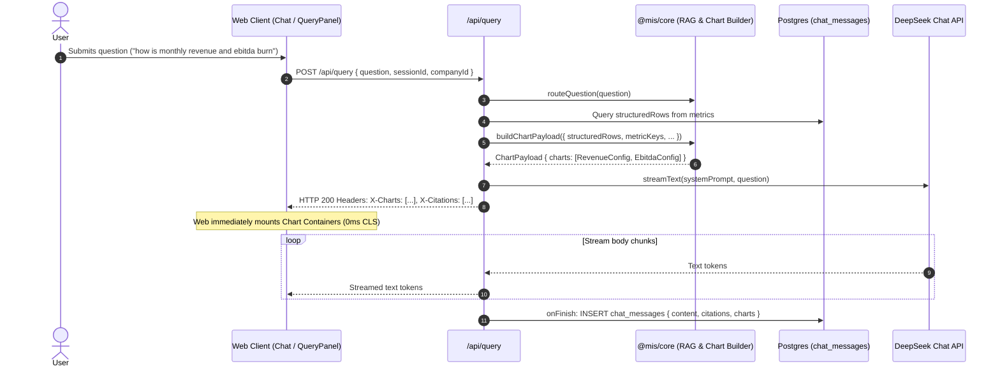
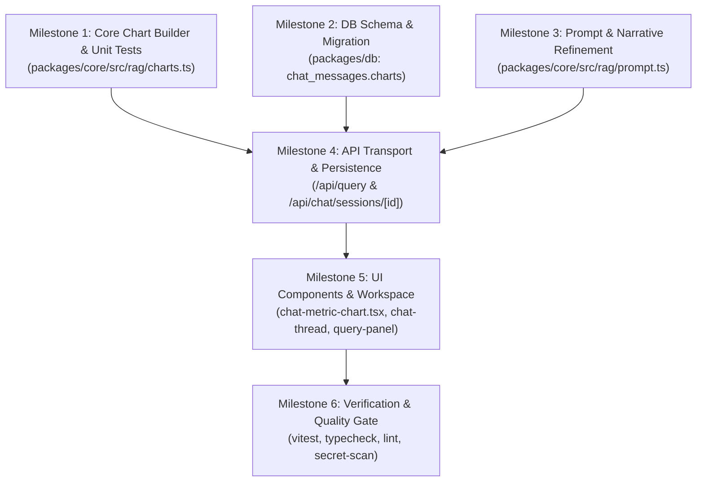

# PLAN CH — Claude-Style Company Answers: Inline Charts + Analyst Narrative

## Executive Summary
This implementation plan specifies the exact technical design and delivery roadmap to reproduce Claude-style financial company answers within the WEH Portfolio Intelligence Dashboard. It addresses three core requirements:
1. **Deterministic Inline Charts**: Separately scaled, zero-baseline bar charts rendered above the answer prose for queried metrics (e.g. Revenue ₹0–450L vs EBITDA burn ₹20L → −₹60L with red negative bars). All chart points are built exclusively from retrieved SQL `metrics` table rows—**never from model-generated numbers**.
2. **Narrative Analyst Prose**: Replacing bullet-first summaries with 2–4 short insight-first paragraphs, bolded key figures, `Jan'26` month notation, movement and turning point explanations, and a closing "**So the trend to watch:**" interpretation line.
3. **Labelled Derivations & Proxy Recommendations**: Refining Rule 3 to permit explicit derivations from actuals (MoM deltas, consecutive-period counts, ×12 monthly and ×4 quarterly annualisation run-rate proxies with `≈`, input citations, and caveat labelling) while keeping future projections and invented baselines strictly forbidden.

---

## Architectural Review & Critique of `RUN_CH_BRIEF.md`

| Item | Architect Draft (`RUN_CH_BRIEF.md`) | Proposed Plan (`PLAN_CH.md`) | Rationale / Decision |
|---|---|---|---|
| **Chart Payload Type** | Flat array: `type ChartPayload = { charts: ChartSeries[] }` | Grouped structure: `type ChartPayload = { charts: ChartConfig[] }` where each `ChartConfig` has `series: ChartSeriesData[]`. | **Challenge & Refine**: If the payload is a flat list of series, a multi-company comparison (e.g., Noto vs Epigamia revenue) would require the frontend to guess whether series should be separate charts or grouped bars. A `ChartConfig` represents **one visual chart card with one Y-axis**. |
| **Transport** | `X-Charts` response header (mirrors `X-Citations`). | `X-Charts` response header with UTF-8 safe encoding + compact JSON. | **Agree**: Delivered at $t=0$ before stream text starts. Prevents layout shift (CLS) and preserves the streaming text contract without SSE changes. |
| **Component Reuse** | Small component in `components/chat/` reused by company query panel. | `apps/web/src/components/chat/chat-metric-chart.tsx` imported by both `chat-message-renderer.tsx` / `chat-thread.tsx` and `query-panel.tsx`. | **Agree**: Eliminates code duplication and guarantees identical visual presentation across the chat interface and the company workspace. |
| **Palette** | Primary `#FF7102`, Negative `#B42318`, Alt `#3A5F8C`, Grid `#E8E5DE`, Ticks `#9A958E`. | Adopt exact WEH CRM palette with Recharts `<Cell>` level negative detection. | **Agree**: Matches design token system in `trend-chart.tsx`. |
| **Rehydration Bug** | Not mentioned in brief. | Fix session rehydration in `chat-workspace.tsx` (`data.messages` vs `data.session.messages`). | **Critical Fix**: Identified in existing code where loading a session failed to populate historical messages. |

---

## 1. Deterministic Chart Data Architecture (Zero Hallucination)

### 1.1 Invariant: Why Charts Cannot Hallucinate
- **Origin**: Chart points are constructed **strictly from database rows** (`metrics` table join `companies` join `documents`) already queried during the structured retrieval phase in `/api/query`.
- **Decoupled from LLM**: The chart builder executes in Node.js before the LLM prompt is sent or during prompt assembly. The LLM output text is never parsed to generate charts.
- **Absence Invariant**: If a metric has no rows in the database for the given company or period, no points are generated, no zeros are interpolated, and the chart for that metric is omitted. If no metrics exist, `charts: []` is returned.

### 1.2 TypeScript Interfaces (`packages/core/src/rag/charts.ts`)
```typescript
export interface ChartPoint {
  period: string;       // Canonical format: 'YYYY-MM' (e.g. '2026-06')
  value: number;        // Raw numeric value in standard unit (e.g. INR 34200000)
}

export interface ChartSeriesData {
  companyId: string | null;
  companyName: string;
  valueKind?: 'reported' | 'calculated' | 'estimated';
  points: ChartPoint[];
}

export interface ChartConfig {
  id: string;                                   // Unique chart key, e.g. "revenue" or "ebitda"
  metricKey: string;                            // Metric identifier matching metric_definitions.key
  label: string;                                // Display label, e.g. "Net Revenue", "EBITDA"
  unit: 'currency' | 'percent' | 'number';
  series: ChartSeriesData[];
}

export interface ChartPayload {
  charts: ChartConfig[];
}
```

### 1.3 Pure Chart Builder Function
Located in `@mis/core` (`packages/core/src/rag/charts.ts`):
```typescript
export interface BuildChartPayloadOptions {
  structuredRows: MetricContextRow[];
  metricKeys?: string[];
  targetCompanyId?: string | null;
  detectedCompanyNames?: string[];
  question?: string;
  maxCharts?: number;              // Default: 4
  maxCompaniesPerChart?: number;   // Default: 5
  defaultPeriodWindow?: number;    // Default: 6
}

export function buildChartPayload(options: BuildChartPayloadOptions): ChartPayload;
```

#### Builder Logic Rules:
1. **Scope & Number of Charts**:
   - **Company-Scoped Query** (e.g., target company identified, or 1 company detected):
     - Builds **one chart per detected metric** (e.g. Chart 1 = Revenue, Chart 2 = EBITDA).
     - Each chart has 1 series corresponding to that company.
     - Max 4 charts total.
   - **Portfolio / Comparison Query** (e.g., "compare revenue of Noto and Epigamia", or portfolio-wide):
     - For each metric, builds **one chart containing up to 5 company series**.
     - Companies are sorted by their latest period value descending.
     - Capped at 5 companies per chart.
2. **Period Windowing**:
   - Analyzes `question` using deterministic regex:
     - Full history trigger: `/\b(all|overall|since inception|entire history|all periods)\b/i` $\to$ Returns all periods.
     - 12-month trigger: `/\b(12m|12 months|past year|last year|last 12)\b/i` $\to$ Returns up to 12 periods.
     - Default: Returns the most recent **6 periods** (`slice(-6)`).
3. **Ordering & Deduplication**:
   - Deduplicates multiple filings for the same `(companyId, metricKey, reportingPeriod)` by picking the latest record.
   - Sorts periods strictly **ascending chronologically** (`'2026-01'` $\to$ `'2026-06'`).
4. **Empty Metric Handling**:
   - If a detected metric has 0 rows in `structuredRows`, it is omitted.
   - If no metrics have rows, returns `{ charts: [] }`.
   - Never outputs artificial placeholder series with `0` or null values.

---

## 2. Transport and Persistence Architecture



### 2.1 HTTP Transport (`X-Charts` Header)
- In `apps/web/src/app/api/query/route.ts`:
  ```typescript
  const chartPayload = buildChartPayload({
    structuredRows,
    metricKeys,
    targetCompanyId,
    detectedCompanyNames,
    question,
  });

  return result.toTextStreamResponse({
    headers: {
      'Content-Type': 'text/plain; charset=utf-8',
      'X-Citations': toHeaderSafeJson(sanitizedCitations),
      'X-Charts': toHeaderSafeJson(chartPayload.charts),
    },
  });
  ```
- **Size & Safety**: Max 4 charts $\times$ 6 periods $\approx$ 24 data points $\approx$ 1.2 KB JSON. Encoded with `toHeaderSafeJson` (ASCII safe), well within standard 8 KB/16 KB header thresholds.
- **Refusal handling**: If no context is found, returns `X-Charts: '[]'`.

### 2.2 Database Schema Change & Drizzle Migration
1. **Schema Update (`packages/db/src/schema/chat.ts`)**:
   ```typescript
   export const chatMessages = pgTable(
     'chat_messages',
     {
       id: uuid('id').defaultRandom().primaryKey(),
       sessionId: uuid('session_id')
         .notNull()
         .references(() => chatSessions.id, { onDelete: 'cascade' }),
       role: chatRoleEnum('role').notNull(),
       content: text('content').notNull(),
       citations: jsonb('citations')
         .$type<Array<Record<string, unknown>>>()
         .default(sql`'[]'::jsonb`),
       charts: jsonb('charts')
         .$type<Array<Record<string, unknown>>>()
         .default(sql`'[]'::jsonb`),
       createdAt: timestamp('created_at', { withTimezone: true }).defaultNow().notNull(),
     },
     (table) => [
       index('chat_messages_session_id_idx').on(table.sessionId),
     ]
   );
   ```
2. **SQL Migration (`packages/db/drizzle/0002_add_chat_message_charts.sql`)**:
   ```sql
   ALTER TABLE "chat_messages" ADD COLUMN "charts" jsonb DEFAULT '[]'::jsonb;
   ```
3. **Drizzle Meta Journal (`packages/db/drizzle/meta/_journal.json`)**:
   Add entry index `2` with tag `"0002_add_chat_message_charts"`.

### 2.3 Rehydration & Session Detail API
- **Endpoint**: `apps/web/src/app/api/chat/sessions/[id]/route.ts`:
  Select `charts: chatMessages.charts` alongside `citations` and `content`.
- **Client Bug Fix (`apps/web/src/components/chat/chat-workspace.tsx`)**:
  ```typescript
  // Fix: data.messages is returned by the API, data.session does not nest messages
  const loadedMessages = data.messages || data.session?.messages || [];
  setMessages(loadedMessages);
  ```
- **ChatMessage Interface (`apps/web/src/components/chat/chat-types.ts`)**:
  Add `charts?: ChartConfig[];` to `ChatMessage`.

---

## 3. Chart Component Design (`ChatMetricChart`)

### 3.1 Design Principles & Visual Hierarchy
- **Location**: Rendered **above** the assistant answer prose inside the response card.
- **Separate Axes per Metric**: Never combine metrics of different magnitudes. Revenue (₹0–450L) and EBITDA burn (₹20L $\to$ −₹60L) render in two separate stacked chart cards.
- **Zero Baseline & Negative Highlighting**:
  - Recharts `<ReferenceLine y={0} stroke="#E8E5DE" />` renders zero line.
  - Positive bars: `#FF7102` (WEH Orange).
  - Negative bars: `#B42318` (CRM Destructive Red).
  - Alt series (comparison company): `#3A5F8C` (Navy).
- **Typography & Numeral Styling**:
  - Ticks: `font-mono text-[10px] text-[#9A958E]`.
  - Numerals: Tabular numbers formatted with `₹ L / ₹ Cr` (reusing `formatIndianCurrency` logic).
  - Header: Micro-label `font-mono text-[10px] uppercase tracking-[0.16em] text-[#9A958E]`.
- **Responsiveness**:
  - Height: Fixed at `170px` per chart. Max 2 visible above fold on desktop.
  - Mobile: Full width, `min-w-[280px]`, no horizontal overflow at 412 px.
  - Layout Shift (CLS): Chart container mounts immediately upon receiving `X-Charts` header, before text tokens start streaming.
- **Memoisation**: Component and data transforms wrapped in `React.memo` and `React.useMemo`.

### 3.2 Component Code (`apps/web/src/components/chat/chat-metric-chart.tsx`)
```typescript
'use client';

import * as React from 'react';
import {
  ResponsiveContainer,
  BarChart,
  Bar,
  XAxis,
  YAxis,
  CartesianGrid,
  Tooltip as RechartsTooltip,
  Cell,
  ReferenceLine,
} from 'recharts';
import { cn } from '@/lib/utils';
import { formatIndianCurrency, formatPercent, formatPeriod } from '@/lib/formatters';
import type { ChartConfig } from '@mis/core';

interface ChatMetricChartProps {
  charts: ChartConfig[];
  className?: string;
}

export const ChatMetricChart = React.memo(function ChatMetricChart({
  charts,
  className,
}: ChatMetricChartProps) {
  if (!charts || charts.length === 0) return null;

  return (
    <div className={cn('space-y-3 my-2', className)}>
      {charts.slice(0, 4).map((chart) => (
        <SingleMetricChart key={chart.id || chart.metricKey} chart={chart} />
      ))}
    </div>
  );
});

function SingleMetricChart({ chart }: { chart: ChartConfig }) {
  const isCurrency = chart.unit === 'currency';
  const isPercent = chart.unit === 'percent';

  // Format Recharts data structure
  const { chartData, seriesKeys, startPeriod, endPeriod } = React.useMemo(() => {
    const periodMap = new Map<string, Record<string, any>>();
    const keys: string[] = [];

    chart.series.forEach((s) => {
      const key = s.companyName || 'Value';
      keys.push(key);
      s.points.forEach((p) => {
        if (!periodMap.has(p.period)) {
          periodMap.set(p.period, {
            period: p.period,
            formattedPeriod: formatPeriod(p.period),
          });
        }
        periodMap.get(p.period)![key] = p.value;
      });
    });

    const data = Array.from(periodMap.values()).sort((a, b) =>
      a.period.localeCompare(b.period)
    );

    const start = data[0]?.formattedPeriod || '';
    const end = data[data.length - 1]?.formattedPeriod || '';

    return { chartData: data, seriesKeys: keys, startPeriod: start, endPeriod: end };
  }, [chart]);

  const formatYAxisTick = (val: number) => {
    if (val === 0) return '0';
    if (isPercent) return `${val.toFixed(0)}%`;
    if (isCurrency) {
      const abs = Math.abs(val);
      const sign = val < 0 ? '-' : '';
      if (abs >= 10_000_000) return `${sign}₹${(abs / 10_000_000).toFixed(1)}Cr`;
      if (abs >= 100_000) return `${sign}₹${(abs / 100_000).toFixed(0)}L`;
      if (abs >= 1_000) return `${sign}₹${(abs / 1_000).toFixed(0)}k`;
      return `${sign}₹${abs}`;
    }
    return val.toLocaleString('en-IN');
  };

  const isMultiSeries = seriesKeys.length > 1;

  return (
    <div className="rounded-xl border border-[#E8E5DE] dark:border-[#2E2A24] bg-white dark:bg-[#1C1A17] p-3.5 shadow-2xs">
      {/* Micro-label header */}
      <div className="flex items-center justify-between mb-2">
        <div className="text-[10px] font-mono font-semibold uppercase tracking-[0.16em] text-[#9A958E] dark:text-[#A8A39A]">
          {chart.label} {chart.series[0]?.companyName ? `· ${chart.series[0].companyName}` : ''}
        </div>
        <div className="text-[10px] font-mono text-[#C8C3BB]">
          {startPeriod && endPeriod ? `${startPeriod} → ${endPeriod}` : `${chartData.length} periods`}
        </div>
      </div>

      <div className="h-[150px] w-full">
        <ResponsiveContainer width="100%" height="100%">
          <BarChart data={chartData} margin={{ top: 8, right: 8, left: -14, bottom: 0 }}>
            <CartesianGrid strokeDasharray="3 3" vertical={false} stroke="#E8E5DE" />
            <ReferenceLine y={0} stroke="#E8E5DE" />
            <XAxis
              dataKey="formattedPeriod"
              stroke="#9A958E"
              fontSize={10}
              tickLine={false}
              axisLine={false}
            />
            <YAxis
              stroke="#9A958E"
              fontSize={10}
              tickLine={false}
              axisLine={false}
              tickFormatter={formatYAxisTick}
            />
            <RechartsTooltip content={<ChartTooltip unit={chart.unit} />} />
            {seriesKeys.map((key, idx) => (
              <Bar key={key} dataKey={key} radius={[3, 3, 0, 0]} isAnimationActive={false}>
                {chartData.map((entry, entryIdx) => {
                  const val = entry[key];
                  const fill = val < 0
                    ? '#B42318'
                    : isMultiSeries && idx > 0
                    ? '#3A5F8C'
                    : '#FF7102';
                  return <Cell key={`cell-${entryIdx}`} fill={fill} />;
                })}
              </Bar>
            ))}
          </BarChart>
        </ResponsiveContainer>
      </div>
    </div>
  );
}

function ChartTooltip({ active, payload, unit }: any) {
  if (active && payload && payload.length) {
    const item = payload[0];
    const isCurrency = unit === 'currency';
    const isPercent = unit === 'percent';
    const val = item.value;
    const formatted = isPercent
      ? formatPercent(val)
      : isCurrency
      ? formatIndianCurrency(val)
      : val.toLocaleString('en-IN');

    return (
      <div className="rounded-lg border border-[#E8E5DE] dark:border-[#2E2A24] bg-white dark:bg-[#1C1A17] p-2 shadow-md text-xs space-y-0.5">
        <div className="font-mono text-[10px] text-[#9A958E]">{item.payload.formattedPeriod}</div>
        <div className={cn("font-bold font-mono tabular-nums", val < 0 ? "text-[#B42318]" : "text-[#FF7102]")}>
          {formatted}
        </div>
      </div>
    );
  }
  return null;
}
```

---

## 4. Prompt Refinement for Narrative Voice & Safe Derivations

### 4.1 System Prompt Refinements (`packages/core/src/rag/prompt.ts`)

#### Refined Rule 3: No Forecasting & Labelled Actuals Derivations
```markdown
3. No forecasting / Labelled actuals derivations: Never predict a future value. No projections into future periods. Deriving from actuals is permitted and encouraged when explicitly labelled:
   - MoM deltas and percentage changes
   - Turning points (e.g. 'flipped positive in Mar'26')
   - Consecutive-period counts (e.g. 'EBITDA-profitable for 4 straight months')
   - Annualised run-rate proxies from latest reported actuals (e.g. month × 12 or quarter × 4) — each must show the arithmetic inline with ≈, cite the source rows, and explicitly name the caveat (e.g. 'the sheet has no explicit ARR line; this is a revenue-based proxy'). When multiple proxies exist, state which is the more robust proxy and why (e.g. quarterly run-rate smooths monthly volatility).
   Never invent baseline actuals. If asked to predict the future, decline plainly.
```

#### Refined Rule 8: Reported vs Calculated
```markdown
8. REPORTED VS CALCULATED: Label anything you compute as [CALCULATED] or show the explicit derivation inline with citations of its inputs. For run-rate proxies, show the exact arithmetic, e.g. "Jun'26 Net Revenue ₹3.42 Cr [1] → annualized (×12) ≈ ₹41.0 Cr [CALCULATED]". If a number is directly stated in the MIS, report it as stated.
```

#### Refined FORMAT Section: Analyst Narrative Prose
```markdown
FORMAT
- 2–4 short paragraphs of narrative analyst prose, insight first.
- Bold key figures (**₹3.42 Cr**, **₹1.94 Cr**, **-₹20L**, **+14.2%**).
- Month labels formatted in the clean style: Jan'26, Apr'26, Jun'26.
- Explain the movement and turning points, not just a data dump ("burn narrowed sharply and flipped positive in Mar'26", "revenue grew steadily Jan→Apr'26 but dipped two months running").
- A bulleted list is allowed only when listing 3+ derived proxy options.
- Conclude with a short interpretation line: "**So the trend to watch:** [1–2 sentences on what the trajectory implies, grounded strictly in the data]".
- Final line: "Basis: [Company · Period · Metrics] [citations]" with coverage caveat.
- Keep concise: under ~200 words unless comparing multiple companies in a table.
- No filler, no pleasantries, no headings like "Summary:".
```

#### Illustrative Reference Patterns (Injected into Prompt)
```markdown
ILLUSTRATIVE PATTERNS (SHAPE ONLY — ADAPT TO RETRIEVED DATA):

Pattern 1 — Multi-Metric Trend:
**Revenue grew steadily Jan→Apr'26** (₹1.94 Cr → ₹4.48 Cr) [1][2] but has dipped two months running since, down to **₹3.42 Cr in Jun'26** [3]. **EBITDA burn narrowed sharply and flipped positive in Mar'26** [2] — the company's been EBITDA-profitable for 4 straight months now [2][3]. But that profit is also shrinking: ₹12L (Apr) → ₹11.3L (May) → **₹7.3L in Jun'26** [3].

**So the trend to watch:** burn is gone, but both revenue and profit are cooling off after the April peak.
Basis: Noto · Jan'26–Jun'26 · Revenue, EBITDA [1][2][3].

Pattern 2 — Derived Proxy with Caveat:
Noto does not have an explicit ARR line in the sheet — it is revenue-based, not subscription. Using the latest actuals: Jun'26 Net Revenue ₹3.42 Cr [3] → annualized (×12) ≈ **₹41.0 Cr** [CALCULATED].

**The quarterly run-rate (~₹47.6 Cr)** based on Q1 actuals ₹11.9 Cr [1][2][3] × 4 is probably the better proxy since it smooths month-to-month volatility.
Basis: Noto · Jun'26 · Net Revenue [3].
```

### 4.2 Anti-Hallucination Invariants
1. **Outside-Knowledge Ban Preserved**: The model cannot use external knowledge about the company.
2. **Every Actual Number Must Carry a Citation**: Every baseline number cited must exist in the context blocks.
3. **`validateCitations` Active**: Post-generation sanitizer drops any fabricated citation marker (e.g. `[9]` when only 3 exist).
4. **Deterministic Refusal**: If no metrics or document excerpts exist, `getNoContextRefusal` triggers with zero LLM inference.
5. **No Forecasts**: Projections for unfiled future periods remain strictly prohibited.

---

## 5. Verification and Test Plan

### 5.1 Unit Tests

#### A. Chart Builder Unit Tests (`tests/chart-builder.test.ts` [NEW])
- `test_recent_6_periods_default`: Given 10 chronological monthly rows for Noto revenue, builder returns exactly the last 6 periods in ascending order.
- `test_explicit_range_detection`: Question containing "all periods" returns all 10 periods; question containing "last 12 months" returns up to 12.
- `test_multi_metric_separate_charts`: Question with `revenue` and `ebitda` returns 2 charts, each with its own unit and series.
- `test_portfolio_comparison_capping`: Single metric query with 8 companies produces 1 chart with top 5 companies sorted by latest value.
- `test_negative_values_preserved`: Verifies EBITDA burn values (-2000000) are preserved unrounded as raw numbers.
- `test_missing_metric_omission`: When a requested metric has no rows, it is omitted from `charts`. If no rows match, returns `{ charts: [] }`.
- `test_anti_hallucination_guarantee`: Validates that every `(period, value)` pair in the generated `ChartPayload` is strictly present in the input `MetricContextRow[]`.

#### B. Analyst Prompt Invariants (`tests/analyst-prompt.test.ts` [UPDATE])
- Verify prompt contains updated Rule 3 and Rule 8 text.
- Verify prompt contains narrative prose instructions and "**So the trend to watch:**".
- Verify citation sanitization still drops invalid indices while keeping calculations intact.

#### C. Persistence & Rehydration Tests (`tests/chat-sessions.test.ts` [UPDATE])
- Verify `chat_messages` inserts store `charts` JSON.
- Verify `GET /api/chat/sessions/[id]` returns `charts` array on messages.
- Verify `chat-workspace.tsx` message loading rehydrates charts.

### 5.2 End-to-End Verification Scenarios

| Scenario | Input Query & Scope | Expected Headers & Charts | Expected Text Output Shape |
|---|---|---|---|
| **1. Multi-metric trend (Reference 1)** | "how is the monthly revenue for the past few months and how is the ebitda burn" (Company: Noto) | `X-Charts` contains 2 separate charts: 1) Revenue (₹0–450L), 2) EBITDA Burn (positive/negative with red negative bars). | Narrative prose, bolded values (`**₹3.42 Cr**`), `Jan'26` notation, movement explained, closing "**So the trend to watch:**". |
| **2. ARR / Run-rate Proxy (Reference 2)** | "what is the current arr that noto is running" (Company: Noto) | `X-Charts` contains 1 chart for Revenue actuals. | Notes no explicit ARR line, derives annualized (×12) with `≈`, recommends quarterly run-rate proxy as smoother alternative. |
| **3. Portfolio comparison** | "compare revenue across companies" | `X-Charts` contains 1 chart with grouped bars for up to 5 companies. | Compares companies, notes population coverage, cites sources. |
| **4. Missing data refusal** | "what was the revenue for UnfiledCo in 2026" | `X-Charts: '[]'`, `X-Citations: '[]'` | Deterministic refusal naming missing company, no charts rendered. |

---

## 6. Implementation Milestones and Sequencing



### Detailed Sequencing:
- **Step 1 (Milestone 1 - Core)**: Implement `packages/core/src/rag/charts.ts` and test in `tests/chart-builder.test.ts`. Export from `packages/core/src/index.ts`.
- **Step 2 (Milestone 2 - DB)**: Update `packages/db/src/schema/chat.ts`, generate `0002_add_chat_message_charts.sql`, update `_journal.json`.
- **Step 3 (Milestone 3 - Prompt)**: Refine prompt rules in `packages/core/src/rag/prompt.ts`, update `tests/analyst-prompt.test.ts`.
- **Step 4 (Milestone 4 - API)**: Update `/api/query/route.ts` to emit `X-Charts` and persist charts. Update `/api/chat/sessions/[id]/route.ts` to select `charts`.
- **Step 5 (Milestone 5 - UI)**: Build `apps/web/src/components/chat/chat-metric-chart.tsx`. Wire into `chat-thread.tsx`, `chat-workspace.tsx`, and `apps/web/src/components/ai/query-panel.tsx`.
- **Step 6 (Milestone 6 - Verification)**: Run `npm run typecheck`, `npm run lint`, `npm test`, `npm run build`.

---

## 7. Risks and Mitigation Strategies

1. **HTTP Header Size Overflow**:
   - *Risk*: A query spanning dozens of periods could exceed the 8 KB HTTP header threshold.
   - *Mitigation*: Hard-cap `charts` at 4, cap `points` at 12 periods max. Keep chart payload compact (~1–2 KB).
2. **LLM Hallucinating Beyond Derived Actuals**:
   - *Risk*: Permitting derivations could cause the model to extrapolate ungrounded estimates or forecast future quarters.
   - *Mitigation*: The prompt explicitly restricts derivations to actuals, requires inline arithmetic with `≈`, mandates input citations `[n]`, and explicitly forbids future forecasting.
3. **Cumulative Layout Shift (CLS) on Streaming**:
   - *Risk*: Charts popping in after text has finished streaming would cause jarring layout shift.
   - *Mitigation*: Charts are transported in the initial HTTP response headers (`X-Charts`), mounting the chart component at $t=0$ before or simultaneously with the first text chunk.
4. **Mobile 412 px Viewport Overflow**:
   - *Risk*: Recharts containers overflowing on small screens.
   - *Mitigation*: Fixed height (`150px`–`170px`), responsive width with `ResponsiveContainer`, minimal margins (`left: -14`), and compact tick formatters.

---

## 8. Decisions Needed from the Architect

Before starting code implementation, please confirm alignment on the following two decisions:

1. **Chart Payload Data Structure**:
   - **Recommendation**: Adopt `ChartConfig[]` with `series: ChartSeriesData[]` (1 chart = 1 independent Y-axis). This cleanly handles both single-company multi-metric charts and multi-company single-metric comparison charts.
   - *Alternative*: Keep flat `ChartSeries[]` from `RUN_CH_BRIEF.md`, which forces the frontend to reconstruct groupings at runtime.
2. **Chart Height & Stacking Limit**:
   - **Recommendation**: Fixed `170px` height per chart card, max 2 visible without scroll on standard laptop viewports, stacked vertically above the prose.
