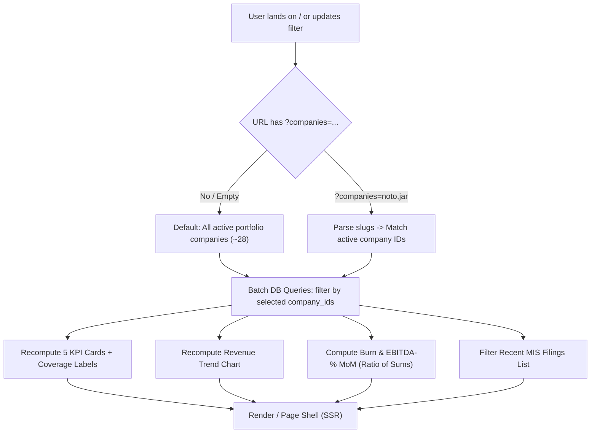

# PLAN DASH — Portfolio Overview Company Filter & Burn / EBITDA-% MoM Chart

## Executive Summary

This implementation plan specifies the complete technical design and verification strategy to address direct client feedback from **WEH Ventures**:
1. *"also isme jo home hai isme portfolio revenue ka sense nhi — better to keep like a filter of companies as per which revenue changes"*
2. *"And burn cum ebitda % month on month graph, kya ye fix kardega tu"*

### Why the Client is Right
Summing raw reported revenue across portfolio companies of wildly different scale (e.g. ₹10k seed-stage testing vs ₹10 Cr growth-stage operations), stages, and fund vintages into a single monolithic "Portfolio revenue" number is economically misleading. When only a subset of portfolio companies have submitted MIS filings for a given period, a raw sum is actively deceptive—it falsely implies portfolio-wide coverage while actually reporting an incomplete sample.

The client's feedback requires two complementary architectural improvements:
1. **Interactive Multi-Select Company Filter (Part A)**: Enables users to choose exactly which companies the dashboard aggregates, driven server-side via URL query parameters (`?companies=noto,jar`), with strict coverage honesty (e.g. `Sum of latest reported revenue · 3 companies with data` instead of bare "Portfolio revenue").
2. **Scale-Independent Burn & EBITDA-% MoM Chart (Part B)**: A dual percentage series month-over-month chart displaying **EBITDA Margin %** and **Burn as % of Revenue** with an emphasized zero baseline. By moving to scale-independent ratios calculated strictly as the **ratio of sums** ($\Sigma\text{EBITDA} \div \Sigma\text{Revenue}$), companies of different sizes can be fairly analyzed across months without distortion.

---

## Architectural Review & Key Design Decisions

| Decision Area | Selected Approach | Alternatives Considered | Rationale |
|---|---|---|---|
| **State Persistence** | URL search params (`?companies=noto,jar`) parsed server-side via Next.js 15 `searchParams` Promise. | Client-side React state (`useState`), `localStorage`, or session cookies. | **Shareable & Refresh-Safe**: URLs can be bookmarked, shared with partners, and properly support browser back/forward navigation. Reuses existing `/companies` pattern without new storage layers. |
| **Aggregation Formula** | **Ratio of Sums**: $(\Sigma \text{EBITDA} \div \Sigma \text{Revenue}) \times 100$ and $-(\Sigma |\text{Burn}| \div \Sigma \text{Revenue}) \times 100$. | Average of company percentages: $\frac{1}{N}\sum (\text{EBITDA}_i / \text{Rev}_i)$. | **Mathematically Sound**: Averaging percentages across different revenue scales is invalid (e.g. averaging an 80% margin on ₹10k with a 5% margin on ₹10 Cr yields an absurd 42.5%, whereas true margin is ~5%). Ratio of sums reflects real fund-level operational performance. |
| **Zero/Missing Revenue Rule** | Companies with zero or missing revenue in a month are **completely excluded** from that month's ratio. | Counting zero revenue company as $0\%$ margin or including its negative EBITDA against zero denominator. | Prevents division by zero ($\div 0$) and avoids artificial distortion of operational margins by pre-revenue entities. |
| **Query Efficiency** | Single batched CTE query grouping by `reporting_period` with filtered aggregations. | N+1 queries per company, or client-side fetch waterfalls. | Executes in $<5\text{ms}$ in PostgreSQL with zero N+1 overhead. Fits Next.js server component batching (`Promise.all`). |
| **Filter UI Component** | Popover with search input, quick selection presets ("All", "None", "With MIS only"), and keyboard navigation. | Bulky inline checklist, native multi-select, or separate modal dialog. | Minimal visual footprint on the page shell; preserves the uncluttered editorial rhythm required by `CLAUDE-DESIGN-RULES.md`. |
| **Chart Visualization** | Dual-series grouped bar chart with single left Y-axis ($\le 4$ ticks), emphasized zero line, and rich checkable tooltips. | Two separate charts, dual Y-axes (left/right), or line chart with hidden data points. | Single left axis avoids scale distortion; zero reference line highlights EBITDA profitability flips; bar value labels ($\le 8$ periods) provide immediate scanning. |

---

## Part A: Company Filter on Overview (`/`)



### 1. Requirements & User Experience
1. **Trigger & Placement**:
   - Integrated into the `PageShell` header / control bar via `filterSlot`.
   - Resting button state:
     - All companies: `All Companies (28) ▾`
     - Filtered subset: `Companies: 3 of 28 selected ▾` (styled with terracotta active tint `#FFEFE2`, border `#FFD0AB`, text `#FF7102`, and a quick `×` clear button).
2. **Interactive Popover Controls**:
   - **Search Input**: Instant filter for company names with autofocus.
   - **Quick Action Pills**:
     - `All`: Selects all 28 companies.
     - `None`: Clears selection.
     - `With MIS only`: Instantly filters to companies that have $\ge 1$ uploaded MIS document.
   - **Checklist**: Scrollable list with company name, industry tag, and subtle filing badge (`Sep'25` or `No MIS`).
   - **Keyboard Navigable**: `Tab` / `Shift+Tab` to move, `Space` to toggle checkbox, `Escape` to close, `Enter` to apply.
3. **URL Synchronization**:
   - Updates URL with `router.push('/?companies=' + slugs.join(','))`.
   - When all companies are selected, omits parameter (`/?`) for clean URLs.
   - Next.js 15 server component receives updated `searchParams` and re-renders server-side with zero client flash.
4. **Coverage Honesty (Strict Invariant)**:
   - "Reporting Rate" KPI card explicitly reports: `${reportingCount} / ${selectedCount}` (e.g. `3 / 8 selected`).
   - Revenue KPI card label dynamically updates:
     - Bare "Portfolio revenue" is **strictly forbidden**.
     - Formatted as: `Sum of latest reported revenue · ${reportingCount} companies with data`.
     - Tooltip: `"Sum of latest reported revenue across ${reportingCount} companies reporting in ${latestPeriod} (out of ${selectedCount} selected). Not portfolio-wide."`
   - Page stat chips reflect: `Selected companies: ${selectedCount} of ${totalCount}`.

---

## Part B: Burn & EBITDA-% Month-on-Month Chart

### 1. Mathematical Formulation & Aggregation Rules

Let $\mathcal{C}_{\text{sel}}$ be the set of selected company IDs. For any reporting period $m \in \mathcal{M}$:
Let $R_{c, m}$ be company $c$'s reported revenue, $E_{c, m}$ be company $c$'s reported EBITDA, and $B_{c, m}$ be company $c$'s reported Net Burn.

#### Contributing Company Set $\mathcal{C}_{m}^*$
$$\mathcal{C}_{m}^* = \left\{ c \in \mathcal{C}_{\text{sel}} \;\middle|\; R_{c, m} \text{ exists, is numeric, and } R_{c, m} > 0 \right\}$$

- **Zero Revenue Exclusion**: Any company with $R_{c, m} \le 0$ or null revenue is strictly excluded from period $m$'s ratio calculation. It is **not** counted as $0\%$ margin, and its EBITDA/burn does not enter the numerator.
- **Period Validity**: If $\mathcal{C}_{m}^* = \emptyset$ or $\sum_{c \in \mathcal{C}_{m}^*} R_{c, m} = 0$, period $m$ is omitted from the chart.

#### Formulas for Eligible Periods
1. **Aggregated Baseline Revenue**:
   $$\text{TotalRevenue}_m = \sum_{c \in \mathcal{C}_{m}^*} R_{c, m}$$
2. **Aggregated Operating EBITDA**:
   $$\text{TotalEbitda}_m = \sum_{c \in \mathcal{C}_{m}^*} E_{c, m}$$
3. **Aggregated Net Burn**:
   $$\text{TotalBurn}_m = \sum_{c \in \mathcal{C}_{m}^*} B_{c, m}$$
4. **EBITDA Margin %**:
   $$\text{EbitdaMarginPct}_m = \left( \frac{\text{TotalEbitda}_m}{\text{TotalRevenue}_m} \right) \times 100$$
5. **Net Burn as % of Revenue**:
   $$\text{BurnPct}_m = -\left( \frac{\left| \text{TotalBurn}_m \right|}{\text{TotalRevenue}_m} \right) \times 100$$
   *(Convention: Burn represents cash outflow, plotted as a negative percentage below the zero baseline)*.

### 2. Chart Layout & Visual Tokens (`CLAUDE-DESIGN-RULES.md`)

```
+-------------------------------------------------------------------------------+
| EBITDA MARGIN % & BURN % (MOM)                     Jun'25 -> Sep'25 (4 mos)   |
| Ratio of sums (Σ EBITDA ÷ Σ Revenue) · 3 companies with data                  |
+-------------------------------------------------------------------------------+
|  +40% |                                                                       |
|       |             +18%                                                      |
|  +20% |             [==]                                                      |
|       |             [==]                                                      |
|    0% +==============|======================================================+ |
|       |     -12%     |             -8%                                        |
|  -20% |     [==]     |             [==]                                       |
|       |     [==]     |             [==]                                       |
|  -40% |     [==]     |             [==]                                       |
|       +---------------------------------------------------------------------+ |
|            Jun'25                 Jul'25                 Aug'25        Sep'25 |
|                                                                               |
|  ● EBITDA Margin % (#FF7102 / #B42318)    ● Net Burn % (#3A5F8C)              |
+-------------------------------------------------------------------------------+
```

- **Single Left Y-Axis**: Formatted with `%` ticks, maximum 4 ticks (e.g. `-40%`, `-20%`, `0%`, `+20%`).
- **Emphasized Zero Baseline**: `<ReferenceLine y={0} stroke="#9A958E" strokeWidth={1.5} />`.
- **Bar Value Labels**: Rendered directly above/below bars when period count $\le 8$ (`formatValueLabel`).
- **CRM Color Tokens**:
  - Positive EBITDA Margin: `#FF7102` (Terracotta)
  - Negative EBITDA Margin: `#B42318` (Error crimson)
  - Net Burn %: `#3A5F8C` (Alt series slate blue, distinct from crimson negative EBITDA)
- **Checkable Tooltip Structure**:
  - Header: Period (e.g. `Sep'25`)
  - Sub-header: `3 of 8 selected companies reporting`
  - Metric rows:
    - `EBITDA Margin: +14.2% (₹48.6 L on ₹3.42 Cr)`
    - `Net Burn: -18.5% (₹63.3 L on ₹3.42 Cr)`
  - Rationale footnote: `Ratio of sums across revenue-generating companies`

---

## Query Layer Architecture & Zero N+1 Design

### 1. Database Queries (`apps/web/src/app/page.tsx`)
All database operations execute concurrently in a single `Promise.all` round-trip.

```typescript
// 1. Fetch company directory metadata + MIS existence in 1 query
const allCompaniesQuery = sql`
  SELECT 
    c.id, c.name, c.slug, c.industry,
    COUNT(d.id)::int as document_count,
    MAX(d.reporting_period) as latest_period
  FROM companies c
  LEFT JOIN documents d ON d.company_id = c.id AND d.status = 'processed'
  WHERE c.archived_at IS NULL
  GROUP BY c.id, c.name, c.slug, c.industry
  ORDER BY c.name ASC
`;

// 2. Resolve selected company IDs from searchParams (?companies=noto,jar)
const selectedSlugs = parseCompanySlugs(params.companies);
const selectedCompanyIds = resolveSelectedIds(allCompanies, selectedSlugs);

// 3. Batched queries with company_id = ANY($selectedCompanyIds)
const [
  docCountRes,
  latestPeriodRes,
  reportingLatestRes,
  revenueTrendRes,
  burnEbitdaMetricsRes,
  recentDocsRes,
] = await Promise.all([
  // Documents processed for selected companies
  db.execute(sql`
    SELECT count(*)::int as count FROM documents
    WHERE status = 'processed' AND company_id = ANY(${selectedCompanyIds}::uuid[])
  `),

  // Latest reporting period across selected companies
  db.execute(sql`
    SELECT reporting_period as period FROM documents
    WHERE reporting_period IS NOT NULL AND status = 'processed'
      AND company_id = ANY(${selectedCompanyIds}::uuid[])
    ORDER BY reporting_period DESC LIMIT 1
  `),

  // Reporting rate in latest period
  db.execute(sql`
    SELECT count(DISTINCT company_id)::int as count FROM documents
    WHERE reporting_period = ${latestPeriod} AND status = 'processed'
      AND company_id = ANY(${selectedCompanyIds}::uuid[])
  `),

  // Revenue trend across periods
  db.execute(sql`
    SELECT reporting_period as period, SUM(value::numeric) as total_revenue
    FROM metrics
    WHERE metric_key = 'revenue' AND reporting_period IS NOT NULL
      AND company_id = ANY(${selectedCompanyIds}::uuid[])
    GROUP BY reporting_period ORDER BY reporting_period ASC
  `),

  // Burn + EBITDA + Revenue matrix by period (for ratio-of-sums calculation)
  db.execute(sql`
    SELECT 
      company_id,
      reporting_period,
      MAX(CASE WHEN metric_key = 'revenue' THEN value::numeric END) as revenue,
      MAX(CASE WHEN metric_key = 'ebitda' THEN value::numeric END) as ebitda,
      MAX(CASE WHEN metric_key = 'burn' THEN value::numeric END) as burn
    FROM metrics
    WHERE metric_key IN ('revenue', 'ebitda', 'burn')
      AND reporting_period IS NOT NULL
      AND company_id = ANY(${selectedCompanyIds}::uuid[])
    GROUP BY company_id, reporting_period
    ORDER BY reporting_period ASC
  `),

  // Recent filings for selected companies
  db.select({...})
    .from(documents)
    .where(and(
      inArray(documents.companyId, selectedCompanyIds),
      eq(documents.status, 'processed')
    ))
    .limit(6),
]);
```

---

## File-by-File Change Plan

```
apps/web/
├── src/
│   ├── app/
│   │   ├── page.tsx                                  [MODIFY: Server searchParams, batched queries, new chart]
│   │   └── companies/[slug]/page.tsx                 [MODIFY: Pass company metrics to BurnEbitdaChart]
│   ├── components/
│   │   ├── dashboard/
│   │   │   ├── portfolio-company-filter.tsx          [NEW: Client popover, search, presets, URL sync]
│   │   │   ├── burn-ebitda-chart.tsx                 [NEW: Recharts dual % MoM series, 0 baseline, tooltips]
│   │   │   └── kpi-card.tsx                          [VERIFY: Support honest coverage label & tooltip]
│   │   └── company/
│   │       └── company-workspace.tsx                 [MODIFY: Add Burn/EBITDA % view to company workspace]
│   └── lib/
│       └── dashboard-calculations.ts                 [NEW: Pure ratio-of-sums and filtering logic]
packages/core/
└── src/
    ├── dashboard/
    │   └── burn-ebitda.ts                            [NEW: Shared deterministic aggregation engine]
    └── index.ts                                      [MODIFY: Export burn-ebitda types & functions]
tests/
└── burn-ebitda-reconciliation.test.ts                [NEW: Vitest unit tests for ratio-of-sums & filter math]
scripts/
└── verify-dash-filter-chart.ts                       [NEW: Headless Puppeteer test with screenshot captures]
```

### 1. `packages/core/src/dashboard/burn-ebitda.ts` [NEW]
Pure calculation module exporting types and calculation functions:
```typescript
export interface CompanyPeriodRow {
  companyId: string;
  companyName?: string;
  reportingPeriod: string; // 'YYYY-MM'
  revenue: number | null;
  ebitda: number | null;
  burn: number | null;
}

export interface BurnEbitdaPoint {
  period: string;             // 'YYYY-MM'
  formattedPeriod: string;    // "Jun'25"
  ebitdaMarginPct: number;    // e.g. 14.5
  burnPct: number;            // e.g. -18.2 (negative)
  sumRevenue: number;         // raw ₹ for tooltip
  sumEbitda: number;          // raw ₹ for tooltip
  sumBurn: number;            // raw ₹ for tooltip
  contributingCompaniesCount: number;
}

export function computeBurnEbitdaSeries(
  rows: CompanyPeriodRow[],
  selectedCompanyIds?: string[]
): BurnEbitdaPoint[];
```

### 2. `apps/web/src/components/dashboard/portfolio-company-filter.tsx` [NEW]
Client Component implementing:
- Keyboard-accessible popover with backdrop dismissal.
- Text search input for instant filtering.
- Quick filter buttons: `All`, `None`, `With MIS only`.
- Checkboxes with company names and MIS badges.
- URL update triggering Next.js server re-render.

### 3. `apps/web/src/components/dashboard/burn-ebitda-chart.tsx` [NEW]
Client Component implementing:
- Recharts `ResponsiveContainer` and `BarChart`.
- Single left Y-axis with max 4 ticks and `%` formatting.
- Reference line at $y = 0$ with `#9A958E` stroke.
- Custom tooltip rendering both `%` and ₹ values.
- Empty state and single-company edge case rendering.

### 4. `apps/web/src/app/page.tsx` [MODIFY]
- Accept `searchParams: Promise<{ companies?: string }>`.
- Run single batched CTE query across PostgreSQL.
- Pass filtered data to `PortfolioCompanyFilter`, `KpiCard`, `TrendChart`, and `BurnEbitdaChart`.
- Display honest coverage strings across stat chips and KPI cards.

### 5. `apps/web/src/components/company/company-workspace.tsx` [MODIFY]
- Integrate the `BurnEbitdaChart` component into the company workspace tab/strip, giving single-company MoM margin and burn % comparison.

---

## Reconciliation Tests (`tests/burn-ebitda-reconciliation.test.ts`)

A dedicated Vitest test suite executing without database dependency:

```typescript
describe('Dashboard Calculations: computeBurnEbitdaSeries', () => {
  const fixtureRows: CompanyPeriodRow[] = [
    // Month 1 (2025-01): Noto + Jar + PreRevCo
    { companyId: 'noto', reportingPeriod: '2025-01', revenue: 10_000_000, ebitda: 1_000_000, burn: 1_500_000 },
    { companyId: 'jar', reportingPeriod: '2025-01', revenue: 20_000_000, ebitda: -2_000_000, burn: 3_000_000 },
    { companyId: 'prerev', reportingPeriod: '2025-01', revenue: 0, ebitda: -500_000, burn: 500_000 }, // zero revenue!

    // Month 2 (2025-02): All 3 have revenue
    { companyId: 'noto', reportingPeriod: '2025-02', revenue: 12_000_000, ebitda: 1_500_000, burn: 1_200_000 },
    { companyId: 'jar', reportingPeriod: '2025-02', revenue: 25_000_000, ebitda: -1_000_000, burn: 2_500_000 },
    { companyId: 'prerev', reportingPeriod: '2025-02', revenue: 5_000_000, ebitda: -1_500_000, burn: 2_000_000 },

    // Month 3 (2025-03): Noto flips positive EBITDA, Jar profitable, PreRev no filing
    { companyId: 'noto', reportingPeriod: '2025-03', revenue: 15_000_000, ebitda: 2_000_000, burn: 1_000_000 },
    { companyId: 'jar', reportingPeriod: '2025-03', revenue: 30_000_000, ebitda: 500_000, burn: 1_500_000 },
  ];

  it('proves EBITDA margin equals ratio of sums (ΣEBITDA ÷ ΣRevenue) and excludes zero revenue companies', () => {
    const points = computeBurnEbitdaSeries(fixtureRows);
    const m1 = points.find((p) => p.period === '2025-01')!;

    // Noto (10L rev, 1L ebitda) + Jar (20L rev, -2L ebitda). PreRev (0 rev) EXCLUDED.
    // Sum Rev = 30L (30,000,000). Sum EBITDA = -1L (-1,000,000).
    const expectedMargin = (-1_000_000 / 30_000_000) * 100; // -3.3333%
    expect(m1.ebitdaMarginPct).toBeCloseTo(expectedMargin, 4);
    expect(m1.contributingCompaniesCount).toBe(2);

    // Assert that average of company percentages gives wrong result
    const avgPercentage = ((1_000_000 / 10_000_000) + (-2_000_000 / 20_000_000)) / 2 * 100; // 0.00%
    expect(m1.ebitdaMarginPct).not.toEqual(avgPercentage);
  });

  it('proves burn percentage is negative (-ΣBurn ÷ ΣRevenue * 100)', () => {
    const points = computeBurnEbitdaSeries(fixtureRows);
    const m1 = points.find((p) => p.period === '2025-01')!;

    // Sum Burn = 1.5L + 3.0L = 4.5L (4,500,000). Sum Rev = 30L.
    const expectedBurnPct = -(4_500_000 / 30_000_000) * 100; // -15.00%
    expect(m1.burnPct).toBeCloseTo(expectedBurnPct, 4);
    expect(m1.burnPct).toBeLessThan(0);
  });

  it('proves filtering by selectedCompanyIds reduces aggregate exactly to selected subset', () => {
    const pointsFiltered = computeBurnEbitdaSeries(fixtureRows, ['noto']);
    const m1 = pointsFiltered.find((p) => p.period === '2025-01')!;

    expect(m1.ebitdaMarginPct).toBeCloseTo(10.0, 2); // 1L / 10L * 100
    expect(m1.burnPct).toBeCloseTo(-15.0, 2);        // -1.5L / 10L * 100
    expect(m1.contributingCompaniesCount).toBe(1);
  });

  it('handles single company data correctly without distortion', () => {
    const singleRows = fixtureRows.filter((r) => r.companyId === 'jar');
    const points = computeBurnEbitdaSeries(singleRows);
    expect(points.length).toBe(3);
    expect(points[2]!.ebitdaMarginPct).toBeCloseTo((500_000 / 30_000_000) * 100, 2);
  });
});
```

---

## Headless Browser Verification Plan

We will create `scripts/verify-dash-filter-chart.ts` leveraging Puppeteer with Brave (`/bin/brave`):
1. **Initial Unfiltered State**:
   - Navigate to `/`.
   - Assert all 5 KPI cards render without error.
   - Assert `Burn & EBITDA-% MoM` chart renders with two distinct `<rect>` bar series and an emphasized `<line>` at $y=0$.
   - Assert Y-axis displays `%` formatted tick marks.
   - Capture screenshot: `docs/review/01_overview_unfiltered_chart.png`.
2. **Interactive Company Filter Flow**:
   - Click Company Filter Popover trigger button.
   - Search for `Noto` in the filter search box.
   - Click `Noto` checkbox and click `Apply`.
   - Assert URL changes to `/?companies=noto`.
   - Assert KPI numbers recompute: "Companies Tracked" shows `1` (or `1 of 28`).
   - Assert Revenue KPI card label reads: `Sum of latest reported revenue · 1 company with data`.
   - Assert `BurnEbitdaChart` updates its bars strictly to Noto's margins.
   - Capture screenshot: `docs/review/02_overview_filtered_noto.png`.
3. **Preset Filter Flow**:
   - Open popover, click `With MIS only`, and apply.
   - Assert URL updates and only companies with documents are aggregated.
   - Capture screenshot: `docs/review/03_overview_with_mis_only.png`.
4. **Console Hygiene**:
   - Zero console errors (`page.on('console', ...)`) throughout the test session.

---

## Milestones & Delivery Sequence

1. **Milestone 1 — Pure Calculation Engine & Reconciliation Tests**:
   - Create `packages/core/src/dashboard/burn-ebitda.ts`.
   - Add unit tests in `tests/burn-ebitda-reconciliation.test.ts`.
   - Verify all tests pass with `vitest run`.
2. **Milestone 2 — Company Filter Popover Component**:
   - Build `apps/web/src/components/dashboard/portfolio-company-filter.tsx`.
   - Implement search, presets (`All`, `None`, `With MIS`), keyboard traps, and URL sync.
3. **Milestone 3 — Burn & EBITDA-% MoM Recharts Component**:
   - Build `apps/web/src/components/dashboard/burn-ebitda-chart.tsx`.
   - Zero reference line, dual bar series (`#FF7102`, `#B42318`, `#3A5F8C`), checkable tooltips.
4. **Milestone 4 — Overview & Company Page Integration**:
   - Update `apps/web/src/app/page.tsx` with batched queries and honest coverage labels.
   - Add `BurnEbitdaChart` to company workspace in `company-workspace.tsx`.
5. **Milestone 5 — Headless Verification & Visual Proof**:
   - Run `scripts/verify-dash-filter-chart.ts`.
   - Review screenshots in `docs/review/`.
   - Run full regression: `npm test` (scanner + all tests green).

---

## Decisions Needed from Architect

1. **URL Slug Representation**:
   - *Recommendation*: Comma-separated lowercase slugs (`?companies=noto,jar`). Clean in URL bar, matches existing app conventions.
2. **Zero Total Revenue Fallback**:
   - *Recommendation*: If in a historical month all selected companies had zero revenue, exclude that month from the MoM chart rather than dividing by zero.
3. **Burn Positive Outflow Handling**:
   - *Recommendation*: Because raw files might record burn as either positive outflow magnitude (₹25L) or negative net cash flow (-₹25L), the calculation strictly evaluates `-Math.abs(burn) / revenue * 100` to guarantee correct negative positioning on the Y-axis.
